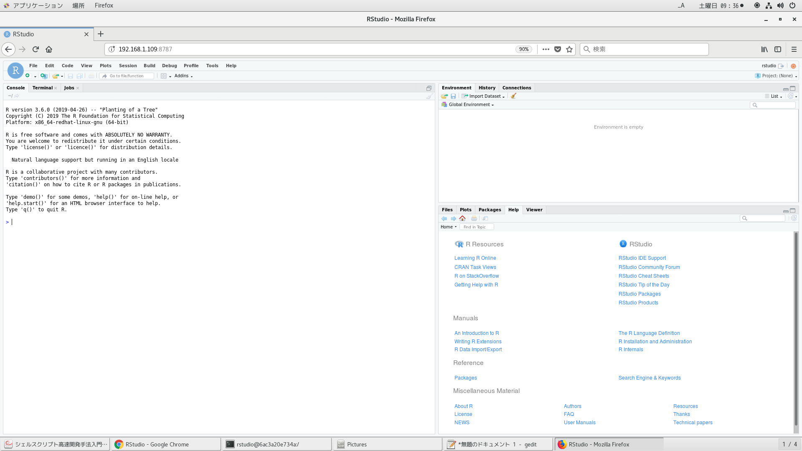
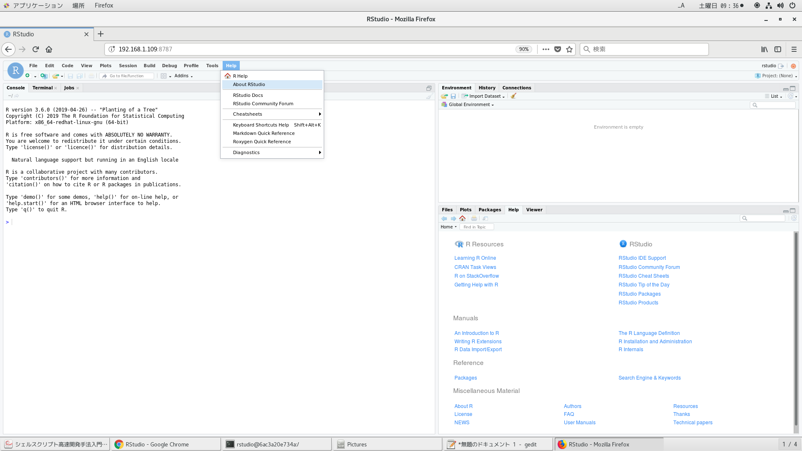
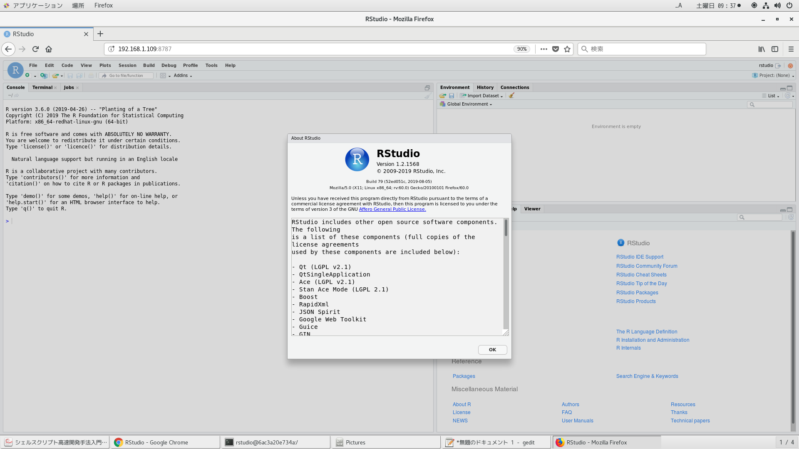

# 事後準備

[最新版Rstudio](https://www.rstudio.com/products/rstudio/download/preview/)

やっぱRstudioインストールしにくいから、一度removeして再インストールした。
```
[rstudio@6b00b3a71130 ~]$ sudo yum remove -y R
[rstudio@6b00b3a71130 ~]$ sudo yum remove -y rstudio-server-1.0.44-1.x86_64
[rstudio@6b00b3a71130 ~]$ sudo yum install -y R
[rstudio@6b00b3a71130 /]$ cd ~
[rstudio@6b00b3a71130 ~]$ ls
[rstudio@6b00b3a71130 ~]$ sudo yum install -y --nogpgcheck https://s3.amazonaws.com/rstudio-ide-build/server/centos6/x86_64/rstudio-server-rhel-1.2.1568-x86_64.rpm
[rstudio@6b00b3a71130 ~]$ sudo systemctl status rstudio-server
● rstudio-server.service - RStudio Server
   Loaded: loaded (/etc/systemd/system/rstudio-server.service; enabled; vendor preset: disabled)
   Active: active (running) since 土 2019-08-17 02:46:33 JST; 37s ago
  Process: 1003 ExecStart=/usr/lib/rstudio-server/bin/rserver (code=exited, status=0/SUCCESS)
 Main PID: 1004 (rserver)
   CGroup: /docker/6b00b3a71130236428090d4e57678a62b2f6733eb9f37830872ab6c9158cdafe/system.slice/rstudio-server.service
           └─1004 /usr/lib/rstudio-server/bin/rserver
           ‣ 1004 /usr/lib/rstudio-server/bin/rserver

 8月 17 02:46:33 6b00b3a71130 systemd[1]: Starting RStudio Server...
 8月 17 02:46:33 6b00b3a71130 systemd[1]: Started RStudio Server.
```

# ブラウザから起動確認

```
http://192.168.1.109:8787/
```






# 環境構築

## DockerfileよりRstudioイメージ作成

```
time docker build -t centos_rstudio2 . | tee log
```

```
[oracle@centos Rstudio]$ docker images
REPOSITORY          TAG                 IMAGE ID            CREATED             SIZE
centos_rstudio2     latest              8dba8b78305e        26 minutes ago      5.81GB
```

## dockerコンテナ作成

87ポートは予約済みなので、8787で外部アクセスできるようにした。
```
docker run --privileged -v /etc/localtime:/etc/localtime -p 8787:8787 --name rstudio -itd centos_rstudio2 /sbin/init
```

## dockerコンテナ削除

やり直すときはクリーンする。
```
docker ps -qa | xargs -I@ bash -c 'docker stop @ && docker rm @'
```

## 不要なdockerイメージ削除

やり直すときはクリーンする。
```
docker images | awk '$1=="<none>"{print $3}' | xargs -I@ docker rmi @
```

## dockerコンテナに潜る

```
[oracle@centos Rstudio]$ docker ps -a
CONTAINER ID        IMAGE               COMMAND             CREATED             STATUS              PORTS                    NAMES
6b00b3a71130        centos_rstudio2     "/sbin/init"        14 minutes ago      Up 14 minutes       0.0.0.0:8787->8787/tcp   rstudio
[oracle@centos Rstudio]$ docker exec --user rstudio -it rstudio bash
[rstudio@6b00b3a71130 /]$   
```

## バージョン情報

```
[root@6b00b3a71130 /]# awk --version    
GNU Awk 5.0.0, API: 2.0
Copyright (C) 1989, 1991-2019 Free Software Foundation.

This program is free software; you can redistribute it and/or modify
it under the terms of the GNU General Public License as published by
the Free Software Foundation; either version 3 of the License, or
(at your option) any later version.

This program is distributed in the hope that it will be useful,
but WITHOUT ANY WARRANTY; without even the implied warranty of
MERCHANTABILITY or FITNESS FOR A PARTICULAR PURPOSE.  See the
GNU General Public License for more details.

You should have received a copy of the GNU General Public License
along with this program. If not, see http://www.gnu.org/licenses/.
[root@6b00b3a71130 /]# bash --version   
GNU bash, バージョン 5.0.0(1)-release (x86_64-pc-linux-gnu)
Copyright (C) 2019 Free Software Foundation, Inc.
ライセンス GPLv3+: GNU GPL バージョン 3 またはそれ以降 <http://gnu.org/licenses/gpl.html>

This is free software; you are free to change and redistribute it.
There is NO WARRANTY, to the extent permitted by law.
[root@6b00b3a71130 /]# python --version
Python 2.7.5
[root@6b00b3a71130 /]# self            
Usage     : self f1 f2 ... file
          : self -d f1 f2 ... string
Version   : Sat Mar 29 20:29:04 JST 2014
          : Open usp Tukubai (LINUX+FREEBSD/PYTHON2.4+, 3.1, 3.2/UTF-8)
[root@6b00b3a71130 /]# R --version                                                                                                                                                                                
R version 3.6.0 (2019-04-26) -- "Planting of a Tree"
Copyright (C) 2019 The R Foundation for Statistical Computing
Platform: x86_64-redhat-linux-gnu (64-bit)

R is free software and comes with ABSOLUTELY NO WARRANTY.
You are welcome to redistribute it under the terms of the
GNU General Public License versions 2 or 3.
For more information about these matters see
https://www.gnu.org/licenses/.
[rstudio@779bd94c825c /]$ vim --version 
VIM - Vi IMproved 8.1 (2018 May 18, compiled Aug 16 2019 18:22:34)
適用済パッチ: 1-1856
Compiled by root@ce903189d2af
Huge 版 without GUI.  機能の一覧 有効(+)/無効(-)
+acl               -farsi             -mouse_sysmouse    -tag_any_white
+arabic            +file_in_path      +mouse_urxvt       -tcl
+autocmd           +find_in_path      +mouse_xterm       +termguicolors
+autochdir         +float             +multi_byte        +terminal
-autoservername    +folding           +multi_lang        +terminfo
-balloon_eval      -footer            -mzscheme          +termresponse
+balloon_eval_term +fork()            +netbeans_intg     +textobjects
-browse            +gettext           +num64             +textprop
++builtin_terms    -hangul_input      +packages          +timers
+byte_offset       +iconv             +path_extra        +title
+channel           +insert_expand     -perl              -toolbar
+cindent           +job               +persistent_undo   +user_commands
-clientserver      +jumplist          +postscript        +vartabs
-clipboard         +keymap            +printer           +vertsplit
+cmdline_compl     +lambda            +profile           +virtualedit
+cmdline_hist      +langmap           -python            +visual
+cmdline_info      +libcall           -python3           +visualextra
+comments          +linebreak         +quickfix          +viminfo
+conceal           +lispindent        +reltime           +vreplace
+cryptv            +listcmds          +rightleft         +wildignore
+cscope            +localmap          -ruby              +wildmenu
+cursorbind        -lua               +scrollbind        +windows
+cursorshape       +menu              +signs             +writebackup
+dialog_con        +mksession         +smartindent       -X11
+diff              +modify_fname      -sound             -xfontset
+digraphs          +mouse             +spell             -xim
-dnd               -mouseshape        +startuptime       -xpm
-ebcdic            +mouse_dec         +statusline        -xsmp
+emacs_tags        -mouse_gpm         -sun_workshop      -xterm_clipboard
+eval              -mouse_jsbterm     +syntax            -xterm_save
+ex_extra          +mouse_netterm     +tag_binary        
+extra_search      +mouse_sgr         -tag_old_static    
      システム vimrc: "$VIM/vimrc"
      ユーザー vimrc: "$HOME/.vimrc"
   第2ユーザー vimrc: "~/.vim/vimrc"
       ユーザー exrc: "$HOME/.exrc"
  デフォルトファイル: "$VIMRUNTIME/defaults.vim"
       省略時の $VIM: "/usr/local/share/vim"
コンパイル: gcc -std=gnu99 -c -I. -Iproto -DHAVE_CONFIG_H     -O2 -fno-strength-reduce -Wall -U_FORTIFY_SOURCE -D_FORTIFY_SOURCE=1       
リンク: gcc -std=gnu99   -L/usr/local/lib -Wl,--as-needed -o vim        -lm -ltinfo -lnsl  -ldl           
[rstudio@779bd94c825c /]$ python --version
Python 3.6.8
[rstudio@779bd94c825c /]$ pip --version
pip 19.2.2 from /usr/local/lib/python3.6/site-packages/pip (python 3.6)
```
