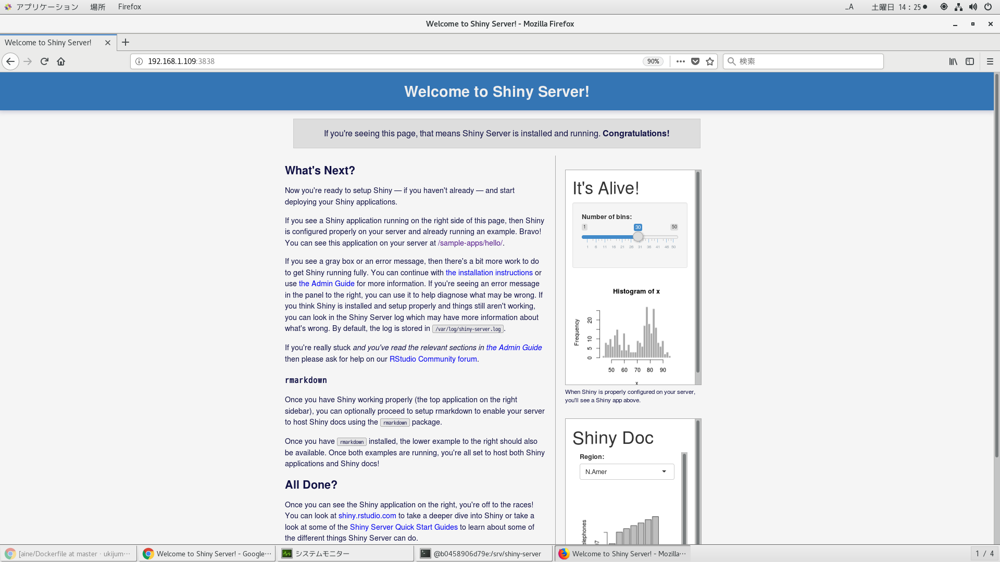

# Dockerfileよりshinyイメージ作成
```
time docker build -t centos_shiny2 . | tee log
```

# dockerコンテナ作成
```
docker run --privileged -v /etc/localtime:/etc/localtime -p 3838:3838 --name shiny -itd centos_shiny /sbin/init
```

# dockerコンテナに潜る
rootユーザーで入る。
```
[oracle@centos shiny]$ docker exec -it shiny bash
```

# shiny-server起動確認
```
[root@e5f42d887d44 shiny-server]# systemctl status shiny-server                                                                                                                                                   
● shiny-server.service - ShinyServer
   Loaded: loaded (/etc/systemd/system/shiny-server.service; enabled; vendor preset: disabled)
   Active: active (running) since 土 2019-08-17 11:23:33 JST; 2min 33s ago
 Main PID: 154 (shiny-server)
   CGroup: /docker/e5f42d887d44fa32bd6c0925eb19d0a218f3d3143d24e55f1796eb1867c2c256/system.slice/shiny-server.service
           └─154 /opt/shiny-server/ext/node/bin/shiny-server /opt/shiny-server/lib/main.js
           ‣ 154 /opt/shiny-server/ext/node/bin/shiny-server /opt/shiny-server/lib/main.js

 8月 17 11:23:33 e5f42d887d44 systemd[1]: Started ShinyServer.
```

# ブラウザから起動確認
```
http://192.168.1.109:3838/
```


