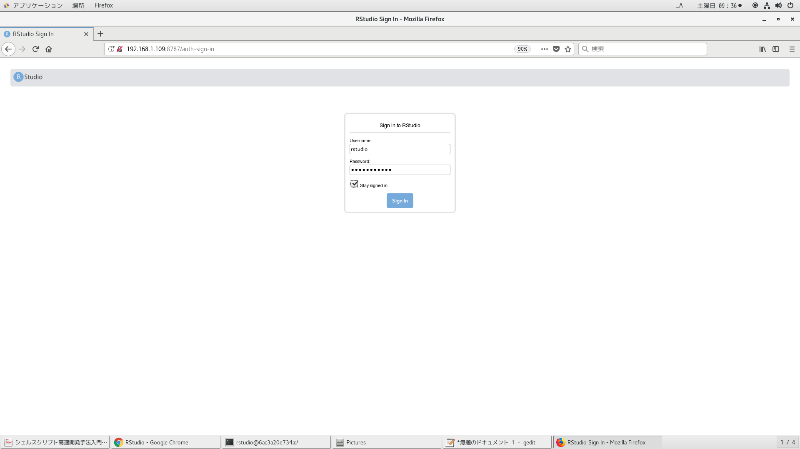
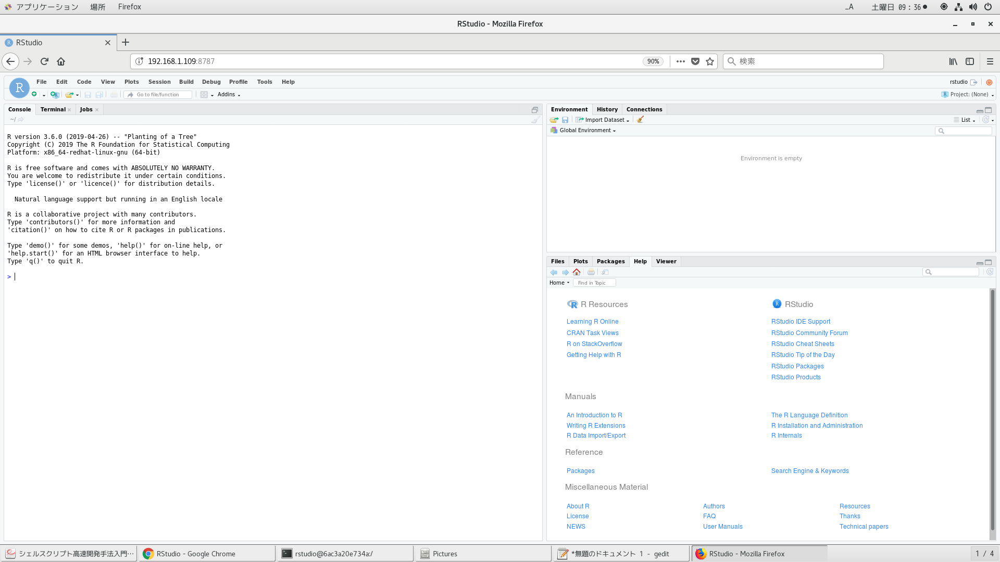
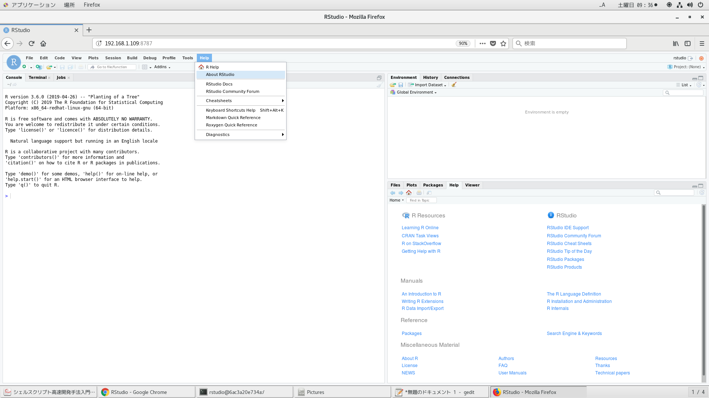
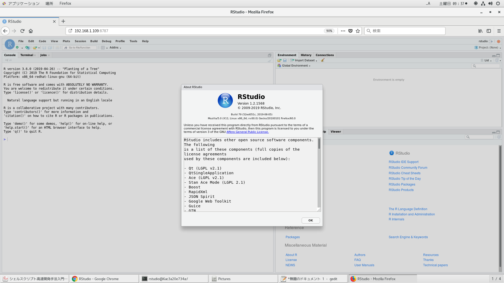
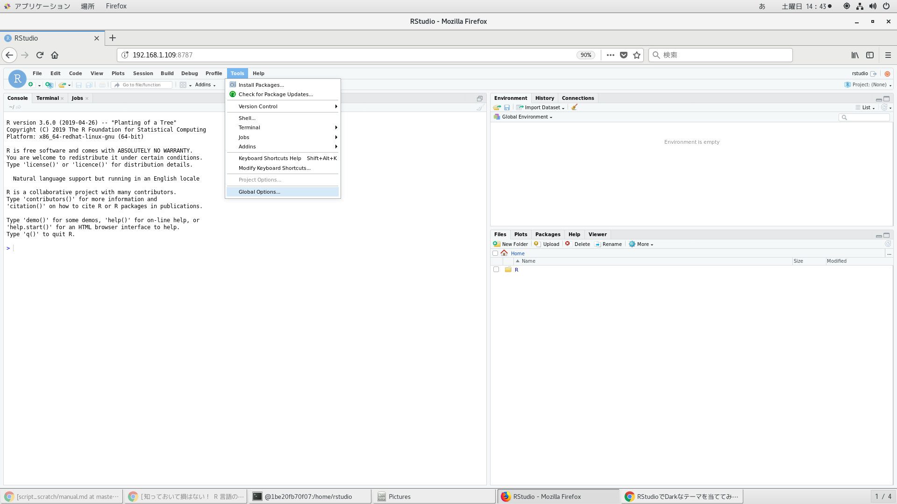
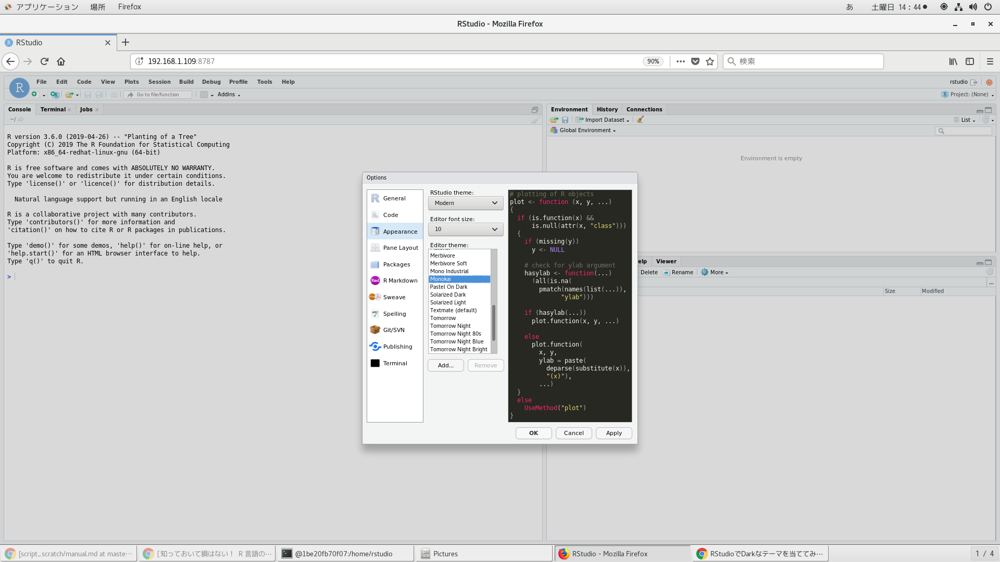
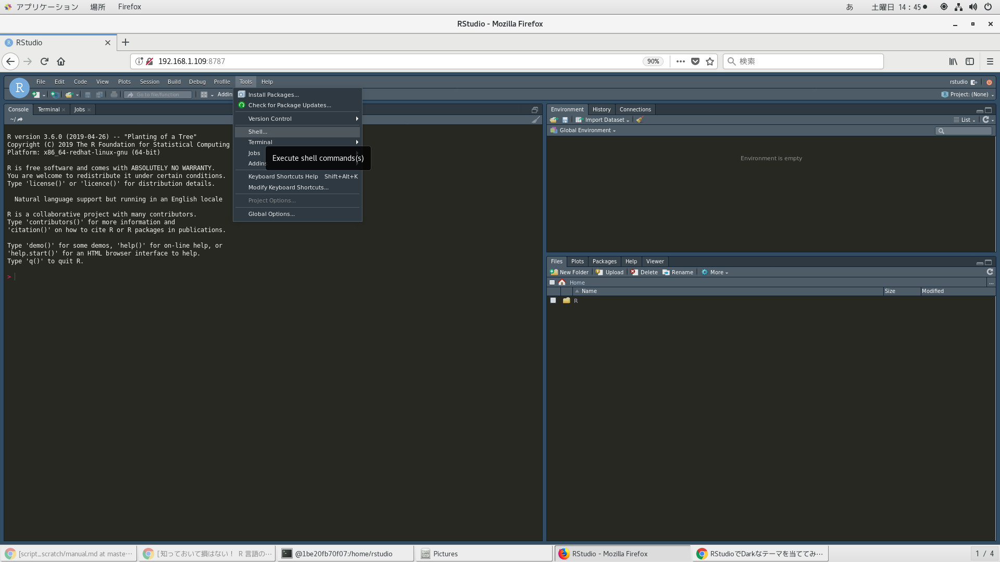
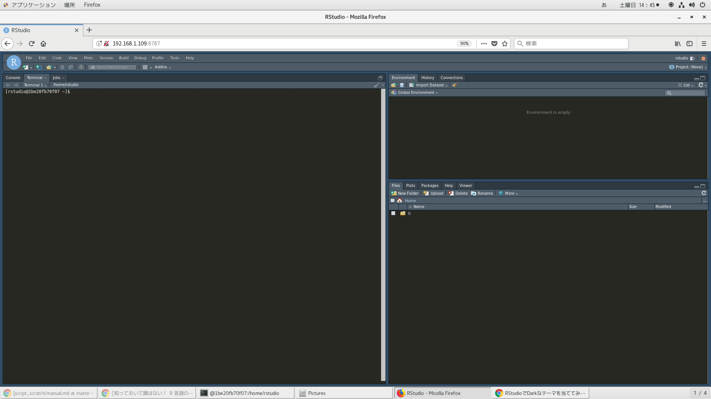
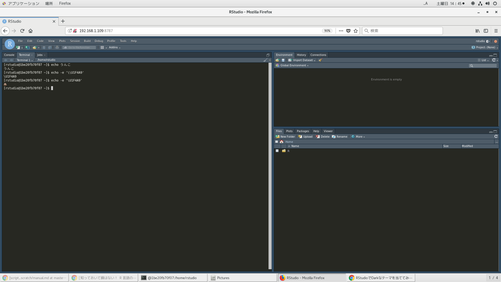

# dockerホストにもインストール

自動起動設定しておいた
```
[root@centos oracle]# userdel rstudio
[root@centos oracle]# useradd rstudio
[root@centos oracle]# usermod -aG docker rstudio
[root@centos oracle]# echo 'rstudio_pwd' | passwd --stdin rstudio
[rstudio@centos ~]$LANG=C xdg-user-dirs-gtk-update
[rstudio@centos ~]sudo yum install -y --nogpgcheck https://s3.amazonaws.com/rstudio-ide-build/server/centos6/x86_64/rstudio-server-rhel-1.2.1568-x86_64.rpm
[rstudio@centos ~]sudo systemctl enable rstudio-server.service
[rstudio@centos ~]$ su root
パスワード:
[root@centos rstudio]# reboot
[rstudio@centos ~]$ sudo systemctl status rstudio-server.service
[sudo] rstudio のパスワード:
● rstudio-server.service - RStudio Server
   Loaded: loaded (/etc/systemd/system/rstudio-server.service; enabled; vendor preset: disabled)
   Active: active (running) since 土 2019-08-24 20:31:27 JST; 1min 0s ago
  Process: 1179 ExecStart=/usr/lib/rstudio-server/bin/rserver (code=exited, status=0/SUCCESS)
 Main PID: 1192 (rserver)
    Tasks: 3
   Memory: 23.2M
   CGroup: /system.slice/rstudio-server.service
           └─1192 /usr/lib/rstudio-server/bin/rserver

 8月 24 20:31:27 centos systemd[1]: Starting RStudio Server...
 8月 24 20:31:27 centos systemd[1]: Started RStudio Server.
```

# dockerホストでの起動確認

```
http://localhost:8787/
```

# 事後準備

[最新版Rstudio](https://www.rstudio.com/products/rstudio/download/preview/)

yum installで固まったら、/sbin/initが動いていない気がするので、PC再起動してやり直す。
やっぱRstudioインストールしにくいから、一度removeして再インストールした。わからない全然わからない。この手順なくしたい。。
```
[root@905d56a22317 rstudio]# yum remove -y rstudio-server
[root@905d56a22317 rstudio]# yum install -y --nogpgcheck https://s3.amazonaws.com/rstudio-ide-build/server/centos6/x86_64/rstudio-server-rhel-1.2.1568-x86_64.rpm
[root@905d56a22317 rstudio]# systemctl status rstudio-server
● rstudio-server.service - RStudio Server
   Loaded: loaded (/etc/systemd/system/rstudio-server.service; enabled; vendor preset: disabled)
   Active: active (running) since 日 2019-08-18 07:51:24 JST; 1min 46s ago
  Process: 780 ExecStart=/usr/lib/rstudio-server/bin/rserver (code=exited, status=0/SUCCESS)
 Main PID: 781 (rserver)
   CGroup: /docker/905d56a22317df6d1052041244b6ccb5fcea0bfe494ad24c510ed53d4f4e4f8b/system.slice/rstudio-server.service
           └─781 /usr/lib/rstudio-server/bin/rserver
           ‣ 781 /usr/lib/rstudio-server/bin/rserver

 8月 18 07:51:24 905d56a22317 systemd[1]: Starting RStudio Server...
 8月 18 07:51:24 905d56a22317 systemd[1]: Started RStudio Server.
```

# ブラウザから起動確認

```
http://192.168.1.109:8787/
```






# Rstudio背景色とか







# 環境構築

## DockerfileよりRstudioイメージ作成

```
time docker build -t centos_rstudio . | tee log
```

```
[oracle@centos Rstudio]$ cat <(docker images | head -n1) <(docker images | awk '$1=="centos_rstudio"{print $0}')
REPOSITORY          TAG                 IMAGE ID            CREATED             SIZE
centos_rstudio      latest              0e0b37a6f5d0        13 minutes ago      3.62GB
```

## dockerコンテナ作成

87ポートは予約済みなので、8787で外部アクセスできるようにした。
マウントするディレクトリは日ごとの作業ディレクトリにする。[blogレポに詳細を記載。](https://github.com/ukijumotahaneniarukenia/blog/blob/master/manual.md)
```
docker run --privileged -v /etc/localtime:/etc/localtime -p 8787:8787 --name rstudio -itd centos_rstudio /sbin/init
```

## dockerコンテナ削除

やり直すときはクリーンする。
```
docker ps -qa | xargs -I@ bash -c 'docker stop @ && docker rm @'
```

## dockerイメージ削除

やり直すときはクリーンする。
```
docker images | awk '$1=="<none>"{print $3}' | xargs -I@ docker rmi @
```

## dockerコンテナ潜入

rootユーザーないし、rstudioユーザー。
```
[oracle@centos Rstudio]$ docker ps -a
CONTAINER ID        IMAGE               COMMAND             CREATED             STATUS              PORTS                    NAMES
4a14c56f6317        centos_rstudio      "/sbin/init"        16 minutes ago      Up 16 minutes       0.0.0.0:8787->8787/tcp   rstudio
[oracle@centos Rstudio]$ docker exec --user root -it rstudio bash
[root@4a14c56f6317 rstudio]# su rstudio
[rstudio@4a14c56f6317 ~]$ exit
[root@4a14c56f6317 rstudio]# exit
[oracle@centos Rstudio]$ docker exec --user rstudio -it rstudio bash
[rstudio@4a14c56f6317 ~]$ su root
Password: 
[root@4a14c56f6317 rstudio]# exit
[rstudio@4a14c56f6317 ~]$ exit
```

## バージョン情報

```
[rstudio@ff3b1f98de1b ~]$ awk --version
GNU Awk 5.0.0, API: 2.0
Copyright (C) 1989, 1991-2019 Free Software Foundation.

This program is free software; you can redistribute it and/or modify
it under the terms of the GNU General Public License as published by
the Free Software Foundation; either version 3 of the License, or
(at your option) any later version.

This program is distributed in the hope that it will be useful,
but WITHOUT ANY WARRANTY; without even the implied warranty of
MERCHANTABILITY or FITNESS FOR A PARTICULAR PURPOSE.  See the
GNU General Public License for more details.

You should have received a copy of the GNU General Public License
along with this program. If not, see http://www.gnu.org/licenses/.
[rstudio@ff3b1f98de1b ~]$ bash --version
GNU bash, バージョン 5.0.0(1)-release (x86_64-pc-linux-gnu)
Copyright (C) 2019 Free Software Foundation, Inc.
ライセンス GPLv3+: GNU GPL バージョン 3 またはそれ以降 <http://gnu.org/licenses/gpl.html>

This is free software; you are free to change and redistribute it.
There is NO WARRANTY, to the extent permitted by law.
[rstudio@ff3b1f98de1b ~]$ vim --version
VIM - Vi IMproved 8.1 (2018 May 18, compiled Aug 18 2019 00:38:14)
適用済パッチ: 1-1879
Compiled by root@b34c60851309
Huge 版 with GTK2 GUI.  機能の一覧 有効(+)/無効(-)
+acl               -farsi             -mouse_sysmouse    -tag_any_white
+arabic            +file_in_path      +mouse_urxvt       -tcl
+autocmd           +find_in_path      +mouse_xterm       +termguicolors
+autochdir         +float             +multi_byte        +terminal
-autoservername    +folding           +multi_lang        +terminfo
+balloon_eval      -footer            -mzscheme          +termresponse
+balloon_eval_term +fork()            +netbeans_intg     +textobjects
+browse            +gettext           +num64             +textprop
++builtin_terms    -hangul_input      +packages          +timers
+byte_offset       +iconv             +path_extra        +title
+channel           +insert_expand     -perl              +toolbar
+cindent           +job               +persistent_undo   +user_commands
+clientserver      +jumplist          +postscript        +vartabs
+clipboard         +keymap            +printer           +vertsplit
+cmdline_compl     +lambda            +profile           +virtualedit
+cmdline_hist      +langmap           -python            +visual
+cmdline_info      +libcall           -python3           +visualextra
+comments          +linebreak         +quickfix          +viminfo
+conceal           +lispindent        +reltime           +vreplace
+cryptv            +listcmds          +rightleft         +wildignore
+cscope            +localmap          -ruby              +wildmenu
+cursorbind        -lua               +scrollbind        +windows
+cursorshape       +menu              +signs             +writebackup
+dialog_con_gui    +mksession         +smartindent       +X11
+diff              +modify_fname      -sound             -xfontset
+digraphs          +mouse             +spell             +xim
+dnd               +mouseshape        +startuptime       -xpm
-ebcdic            +mouse_dec         +statusline        +xsmp_interact
+emacs_tags        -mouse_gpm         -sun_workshop      +xterm_clipboard
+eval              -mouse_jsbterm     +syntax            -xterm_save
+ex_extra          +mouse_netterm     +tag_binary        
+extra_search      +mouse_sgr         -tag_old_static    
      システム vimrc: "$VIM/vimrc"
      ユーザー vimrc: "$HOME/.vimrc"
   第2ユーザー vimrc: "~/.vim/vimrc"
       ユーザー exrc: "$HOME/.exrc"
     システム gvimrc: "$VIM/gvimrc"
     ユーザー gvimrc: "$HOME/.gvimrc"
  第2ユーザー gvimrc: "~/.vim/gvimrc"
  デフォルトファイル: "$VIMRUNTIME/defaults.vim"
    システムメニュー: "$VIMRUNTIME/menu.vim"
       省略時の $VIM: "/usr/local/share/vim"
コンパイル: gcc -std=gnu99 -c -I. -Iproto -DHAVE_CONFIG_H -DFEAT_GUI_GTK  -pthread -I/usr/include/gtk-2.0 -I/usr/lib64/gtk-2.0/include -I/usr/include/atk-1.0 -I/usr/include/cairo -I/usr/include/gdk-pixbuf-2.0 -I/usr/include/pango-1.0 -I/usr/include/fribidi -I/usr/include/glib-2.0 -I/usr/lib64/glib-2.0/include -I/usr/include/harfbuzz -I/usr/include/freetype2 -I/usr/include/libpng15 -I/usr/include/uuid -I/usr/include/pixman-1 -I/usr/include/libdrm     -O2 -fno-strength-reduce -Wall -U_FORTIFY_SOURCE -D_FORTIFY_SOURCE=1       
リンク: gcc -std=gnu99   -L/usr/local/lib -Wl,--as-needed -o vim   -lgtk-x11-2.0 -lgdk-x11-2.0 -latk-1.0 -lgio-2.0 -lpangoft2-1.0 -lpangocairo-1.0 -lgdk_pixbuf-2.0 -lcairo -lpango-1.0 -lfontconfig -lgobject-2.0 -lglib-2.0 -lfreetype   -lSM -lICE -lXt -lX11 -lSM -lICE  -lm -ltinfo -lnsl  -ldl           
[rstudio@ff3b1f98de1b ~]$ vi --version
VIM - Vi IMproved 8.1 (2018 May 18, compiled Aug 18 2019 00:38:14)
適用済パッチ: 1-1879
Compiled by root@b34c60851309
Huge 版 with GTK2 GUI.  機能の一覧 有効(+)/無効(-)
+acl               -farsi             -mouse_sysmouse    -tag_any_white
+arabic            +file_in_path      +mouse_urxvt       -tcl
+autocmd           +find_in_path      +mouse_xterm       +termguicolors
+autochdir         +float             +multi_byte        +terminal
-autoservername    +folding           +multi_lang        +terminfo
+balloon_eval      -footer            -mzscheme          +termresponse
+balloon_eval_term +fork()            +netbeans_intg     +textobjects
+browse            +gettext           +num64             +textprop
++builtin_terms    -hangul_input      +packages          +timers
+byte_offset       +iconv             +path_extra        +title
+channel           +insert_expand     -perl              +toolbar
+cindent           +job               +persistent_undo   +user_commands
+clientserver      +jumplist          +postscript        +vartabs
+clipboard         +keymap            +printer           +vertsplit
+cmdline_compl     +lambda            +profile           +virtualedit
+cmdline_hist      +langmap           -python            +visual
+cmdline_info      +libcall           -python3           +visualextra
+comments          +linebreak         +quickfix          +viminfo
+conceal           +lispindent        +reltime           +vreplace
+cryptv            +listcmds          +rightleft         +wildignore
+cscope            +localmap          -ruby              +wildmenu
+cursorbind        -lua               +scrollbind        +windows
+cursorshape       +menu              +signs             +writebackup
+dialog_con_gui    +mksession         +smartindent       +X11
+diff              +modify_fname      -sound             -xfontset
+digraphs          +mouse             +spell             +xim
+dnd               +mouseshape        +startuptime       -xpm
-ebcdic            +mouse_dec         +statusline        +xsmp_interact
+emacs_tags        -mouse_gpm         -sun_workshop      +xterm_clipboard
+eval              -mouse_jsbterm     +syntax            -xterm_save
+ex_extra          +mouse_netterm     +tag_binary        
+extra_search      +mouse_sgr         -tag_old_static    
      システム vimrc: "$VIM/vimrc"
      ユーザー vimrc: "$HOME/.vimrc"
   第2ユーザー vimrc: "~/.vim/vimrc"
       ユーザー exrc: "$HOME/.exrc"
     システム gvimrc: "$VIM/gvimrc"
     ユーザー gvimrc: "$HOME/.gvimrc"
  第2ユーザー gvimrc: "~/.vim/gvimrc"
  デフォルトファイル: "$VIMRUNTIME/defaults.vim"
    システムメニュー: "$VIMRUNTIME/menu.vim"
       省略時の $VIM: "/usr/local/share/vim"
コンパイル: gcc -std=gnu99 -c -I. -Iproto -DHAVE_CONFIG_H -DFEAT_GUI_GTK  -pthread -I/usr/include/gtk-2.0 -I/usr/lib64/gtk-2.0/include -I/usr/include/atk-1.0 -I/usr/include/cairo -I/usr/include/gdk-pixbuf-2.0 -I/usr/include/pango-1.0 -I/usr/include/fribidi -I/usr/include/glib-2.0 -I/usr/lib64/glib-2.0/include -I/usr/include/harfbuzz -I/usr/include/freetype2 -I/usr/include/libpng15 -I/usr/include/uuid -I/usr/include/pixman-1 -I/usr/include/libdrm     -O2 -fno-strength-reduce -Wall -U_FORTIFY_SOURCE -D_FORTIFY_SOURCE=1       
リンク: gcc -std=gnu99   -L/usr/local/lib -Wl,--as-needed -o vim   -lgtk-x11-2.0 -lgdk-x11-2.0 -latk-1.0 -lgio-2.0 -lpangoft2-1.0 -lpangocairo-1.0 -lgdk_pixbuf-2.0 -lcairo -lpango-1.0 -lfontconfig -lgobject-2.0 -lglib-2.0 -lfreetype   -lSM -lICE -lXt -lX11 -lSM -lICE  -lm -ltinfo -lnsl  -ldl           
[rstudio@ff3b1f98de1b ~]$ python --version
Python 3.6.8
[rstudio@ff3b1f98de1b ~]$ pip --version
pip 19.2.2 from /usr/local/lib/python3.6/site-packages/pip (python 3.6)
```
