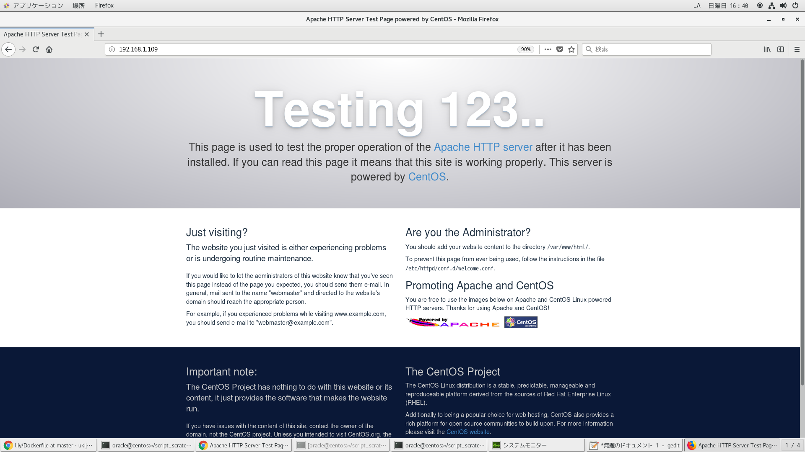

# Dockerfileよりイメージ作成
```
time docker build -t centos_apache . | tee log
```

# dockerコンテナ作成
```
docker run --privileged -v /etc/localtime:/etc/localtime -p 28787:8787 -p 20022:22 -p 8080:80 --name httpd -itd centos_apache /sbin/init
```

# dockerコンテナ削除
```
docker ps -qa | xargs -I@ bash -c 'docker stop @ && docker rm @'
```

# dockerイメージ削除
```
docker images | awk '$1=="<none>"{print $3}' | xargs -I@ docker rmi @
```

# dockerコンテナ潜入
```
[oracle@centos apache]$ docker exec --user root -it httpd bash
[oracle@centos apache]$ docker exec --user apache -it httpd bash
```

# httpd起動確認
```
systemctl status httpd
systemctl start httpd
```

# ブラウザから起動確認
```
http://192.168.1.109:28787/
```

# ブラウザから起動確認
```
http://192.168.1.109:8080/
```


