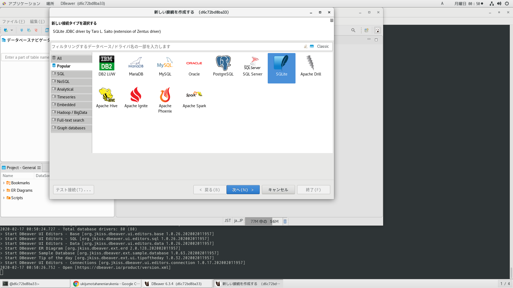
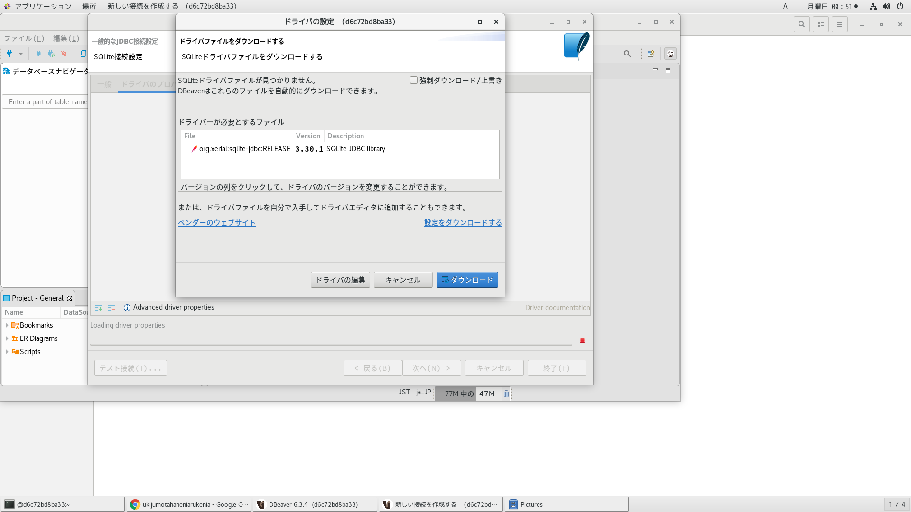

# 参考文献

OpenJDKからいんすこ
https://openjdk.java.net/install/index.html

https://jdk.java.net/
https://jdk.java.net/13/

```
cd /usr/local/src && \
curl -LO https://download.java.net/java/GA/jdk13/5b8a42f3905b406298b72d750b6919f6/33/GPL/openjdk-13_linux-x64_bin.tar.gz && \
tar -zxvf openjdk-13_linux-x64_bin.tar.gz
```

# jshell
https://qiita.com/HomMarkHunt/items/6579cc3587972909d85f
https://twitter.com/EclipseJavaIDE/status/1147044351278747648
```
[java@441a10f53644 /]$jshell
|  JShellへようこそ -- バージョン13
|  概要については、次を入力してください: /help intro

jshell>

jshell>

jshell>

jshell>

jshell> System.out.println("Hello World");
Hello World


```

# 絵文字をjavaで表示

https://qiita.com/carimatics/items/48ca30434f192549283c
https://github.com/vdurmont/emoji-java
Mavenからインストール




ディレクトリ構造
```
[java@441a10f53644 ~/IdeaProjects/untitled]$tree
.
|-- lib
|   |-- emoji-java-5.1.1-javadoc.jar
|   |-- emoji-java-5.1.1-sources.jar
|   |-- emoji-java-5.1.1.jar
|   |-- json-20170516-javadoc.jar
|   |-- json-20170516-sources.jar
|   `-- json-20170516.jar
|-- out
|   `-- production
|       `-- untitled
|           `-- emo.class
|-- src
|   `-- emo.java
`-- untitled.iml

5 directories, 9 files
```

javaファイル作成
```emo.java
import com.vdurmont.emoji.EmojiManager;

public class emo {
    public static void main(String[] args) {
        EmojiManager.getForAlias("name_badge");
        System.out.println(EmojiManager.getForAlias("name_badge").getUnicode());
    }
}
```
コンパイル
```
javac -d ../out/production/untitled -classpath /home/java/IdeaProjects/untitled/out/production/untitled:/home/java/IdeaProjects/untitled/lib/emoji-java-5.1.1.jar:/home/java/IdeaProjects/untitled/lib/json-20170516.jar emo.java
```
実行
```
/home/java/jdk-13/bin/java -javaagent:/home/java/idea-IC-192.6603.28/lib/idea_rt.jar=46144:/home/java/idea-IC-192.6603.28/bin -Dfile.encoding=UTF-8 -classpath /home/java/IdeaProjects/untitled/out/production/untitled:/home/java/IdeaProjects/untitled/lib/emoji-java-5.1.1.jar:/home/java/IdeaProjects/untitled/lib/json-20170516.jar emo
```
実行例
```
[java@441a10f53644 ~/IdeaProjects/untitled/src]$/home/java/jdk-13/bin/java -javaagent:/home/java/idea-IC-192.6603.28/lib/idea_rt.jar=46144:/home/java/idea-IC-192.6603.28/bin -Dfile.encoding=UTF-8 -classpath /home/java/IdeaProjects/untitled/out/production/untitled:/home/java/IdeaProjects/untitled/lib/emoji-java-5.1.1.jar:/home/java/IdeaProjects/untitled/lib/json-20170516.jar emo
📛
```
