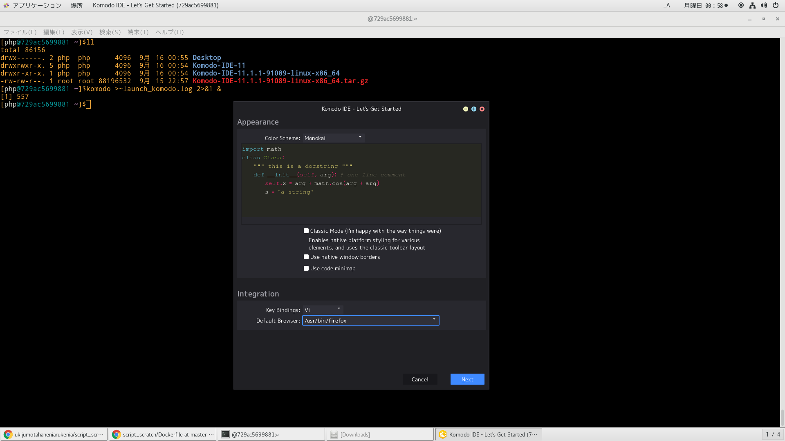
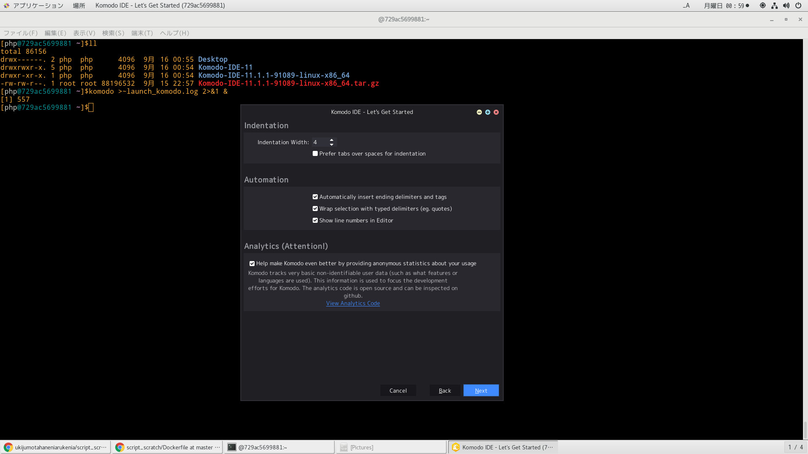
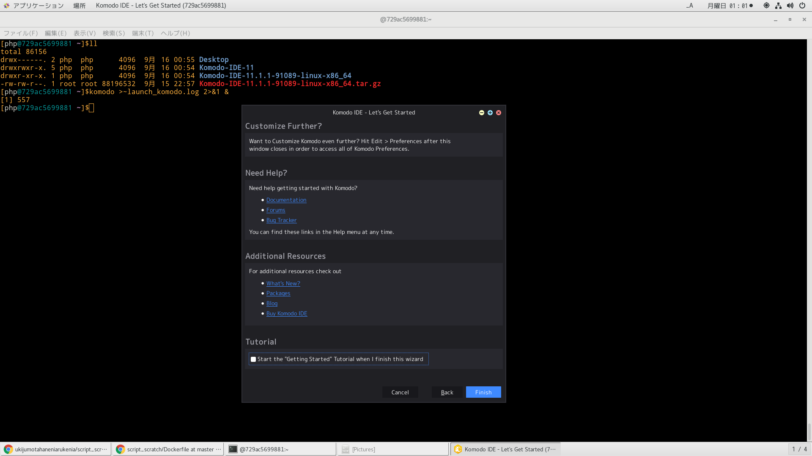
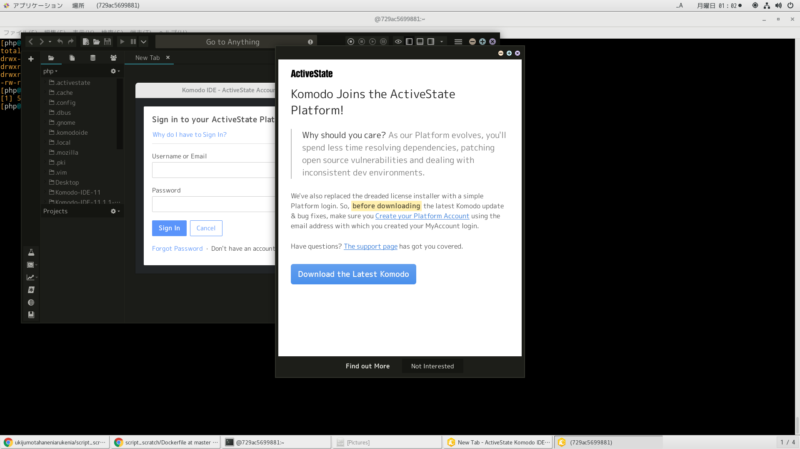

# phpインスト

```
sudo yum -y install http://rpms.famillecollet.com/enterprise/remi-release-7.rpm && \
 sudo yum -y install --enablerepo=remi,remi-php73 php php-devel php-mbstring php-pdo php-gd php-xml php-mcrypt
```

# 参考文献
https://mattintosh.hatenablog.com/entry/20140815/1408057200
https://www.activestate.com/products/komodo-ide/download-ide/#edit
https://shimz.me/blog/category/komodo-edit

IME日本語入力辞書登録
http://tatsu-web.com/jisyo/
日本語から英語に
https://code.google.com/archive/p/google-ime-user-dictionary-ja-en/
日本語からHTMLタグに
https://gist.github.com/suneo3476/5462528
VIMからIMEそうさ
https://qiita.com/ka_/items/dad955fe7423318b7dae

# Dockerfileよりイメージ作成
```
time docker build -t centos-7-6-18-10-php-komodo . | tee log
```

# dockerコンテナ削除
```
docker ps -qa | xargs -I@ bash -c 'docker stop @ && docker rm @'
```

# dockerイメージ削除
```
docker images | awk '$1=="<none>"{print $3}' | xargs -I@ docker rmi @
```

# dockerコンテナ作成
```
docker run --privileged --shm-size=8gb --name centos-7-6-18-10-php-komodo -itd -v /run/udev:/run/udev -v /run/systemd:/run/systemd -v /tmp/.X11-unix:/tmp/.X11-unix -v /var/lib/dbus:/var/lib/dbus -v /var/run/dbus:/var/run/dbus -v /etc/machine-id:/etc/machine-id centos-7-6-18-10-php-komodo
```

# dockerコンテナ潜入
```
docker exec -it centos-7-6-18-10-php-komodo /bin/bash
```

# dockerコンテナ潜入後実行

```
$cd ~/Komodo-Edit-11.1.1-18206-linux-x86_64
$./install.sh
Enter directory in which to install Komodo. Leave blank and
press 'Enter' to use the default [~/Komodo-Edit-11].
Install directory:


==============================================================================
Komodo Edit 11 has been successfully installed to:
    /home/php/Komodo-Edit-11

You might want to add 'komodo' to your PATH by adding the
install dir to you PATH. Bash users can add the following
to their ~/.bashrc file:

    export PATH="/home/php/Komodo-Edit-11/bin:$PATH"

Or you could create a symbolic link to 'komodo', e.g.:

    ln -s "/home/php/Komodo-Edit-11/bin/komodo" /usr/local/bin/komodo

Documentation is available in Komodo or on the web here:
    http://docs.activestate.com/komodo

Please send us any feedback you have through one of the
channels below:
    komodo-feedback@activestate.com
    irc://irc.mozilla.org/komodo
    https://github.com/Komodo/KomodoEdit/issues

Thank you for using Komodo.
==============================================================================
```

# komodo起動

```
[php@d46d7bac3844 ~]$komodo
[1] 535
```







