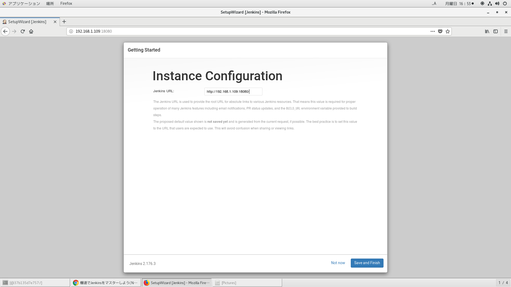

# 参考文献
https://casualdevelopers.com/tech-tips/how-to-install-and-use-jenkins-on-docker-for-nodejs/
https://jenkins.io/download/
https://pkg.jenkins.io/redhat/
https://wiki.jenkins.io/display/JENKINS/Installing+Jenkins+on+Red+Hat+distributions
https://unix.stackexchange.com/questions/9314/no-such-file-or-directory-etc-init-d-functions

# nodeアプリ参考文献
https://casualdevelopers.com/tech-tips/how-to-install-and-use-jenkins-on-docker-for-nodejs/#Jenkins-3
https://casualdevelopers.com/tech-tips/how-to-install-and-use-jenkins-on-docker-for-nodejs/
http://tech-blog.rakus.co.jp/entry/2018/03/05/094238#%E7%92%B0%E5%A2%83%E6%A7%8B%E7%AF%89
https://github.com/ryo-ohnishi/node_express_nginx
https://qiita.com/ryo-ohnishi/items/b54e649b14b51694ef77
https://qiita.com/ryo-ohnishi/items/3653f7583c8591eef333

# jenkins
初期パスワード
```
[root@846e8d2f1f3c jenkins]# pwd
/var/log/jenkins
[root@846e8d2f1f3c jenkins]# grep -C 15 "/var/lib/jenkins/secrets/initialAdminPassword" jenkins.log
INFO: Bean factory for application context [org.springframework.web.context.support.StaticWebApplicationContext@6a124227]: org.springframework.beans.factory.support.DefaultListableBeanFactory@419d889c
Sep 14, 2019 8:06:33 AM org.springframework.beans.factory.support.DefaultListableBeanFactory preInstantiateSingletons
INFO: Pre-instantiating singletons in org.springframework.beans.factory.support.DefaultListableBeanFactory@419d889c: defining beans [filter,legacy]; root of factory hierarchy
Sep 14, 2019 8:06:33 AM jenkins.install.SetupWizard init
INFO: 

*************************************************************
*************************************************************
*************************************************************

Jenkins initial setup is required. An admin user has been created and a password generated.
Please use the following password to proceed to installation:

19791b22e7884d64b2e221cdfc9dde57

This may also be found at: /var/lib/jenkins/secrets/initialAdminPassword

*************************************************************
*************************************************************
*************************************************************

Sep 14, 2019 8:06:38 AM hudson.model.UpdateSite updateData
INFO: Obtained the latest update center data file for UpdateSource default
Sep 14, 2019 8:06:38 AM hudson.model.DownloadService$Downloadable load
INFO: Obtained the updated data file for hudson.tasks.Maven.MavenInstaller
Sep 14, 2019 8:06:38 AM hudson.util.Retrier start
INFO: Performed the action check updates server successfully at the attempt #1
Sep 14, 2019 8:06:38 AM hudson.model.AsyncPeriodicWork$1 run
INFO: Finished Download metadata. 5,423 ms
Sep 14, 2019 8:06:41 AM hudson.model.UpdateSite updateData
INFO: Obtained the latest update center data file for UpdateSource default


```

# jenkins起動
```

```





# githubレポジトリ作成
```
[rstudio@centos ~/unko/script_scratch/jenkins]$mkdir script
[rstudio@centos ~/unko/script_scratch/jenkins]$cd script/
[rstudio@centos ~/unko/script_scratch/jenkins/script]$echo "# sandbox" >> README.md
[rstudio@centos ~/unko/script_scratch/jenkins/script]$git init
Initialized empty Git repository in /home/rstudio/unko/script_scratch/jenkins/script/.git/
[rstudio@centos ~/unko/script_scratch/jenkins/script]$git add README.md
[rstudio@centos ~/unko/script_scratch/jenkins/script]$git commit -m "first commit"
[master (root-commit) ec2b9ff] first commit
 1 file changed, 1 insertion(+)
 create mode 100644 README.md
[rstudio@centos ~/unko/script_scratch/jenkins/script]$git remote add origin https://github.com/ukijumotahaneniarukenia/sandbox.git
[rstudio@centos ~/unko/script_scratch/jenkins/script]$git push -u origin master
Username for 'https://github.com': ukijumotahaneniarukenia
Password for 'https://ukijumotahaneniarukenia@github.com': 
Counting objects: 3, done.
Writing objects: 100% (3/3), 232 bytes | 0 bytes/s, done.
Total 3 (delta 0), reused 0 (delta 0)
To https://github.com/ukijumotahaneniarukenia/sandbox.git
 * [new branch]      master -> master
Branch master set up to track remote branch master from origin.
```

# dockerコンテナ内で作業用レポジトリをクローン
```
[root@37b135d7e757 ~]# git clone https://github.com/ukijumotahaneniarukenia/sandbox.git
Cloning into 'sandbox'...
remote: Enumerating objects: 3, done.
remote: Counting objects: 100% (3/3), done.
remote: Total 3 (delta 0), reused 3 (delta 0), pack-reused 0
Unpacking objects: 100% (3/3), done.
[root@37b135d7e757 ~]# ll
total 12
-rw-------. 1 root root 3415 Aug  1 01:10 anaconda-ks.cfg
drwxr-xr-x. 3 root root 4096 Sep 16 08:17 sandbox
[root@37b135d7e757 ~]# cd sandbox
[root@37b135d7e757 sandbox]# ls
README.md

```

# 作業用レポジトリにコミットする内容

```
[root@37b135d7e757 sandbox]# tree
.
├── README.md
├── src
│   ├── index.js
│   └── utils.js
└── test
    └── utils.js

2 directories, 4 files
[root@37b135d7e757 sandbox]# vi src/index.js 
[root@37b135d7e757 sandbox]# vi src/utils.js 
[root@37b135d7e757 sandbox]# vi test/utils.js
[root@37b135d7e757 sandbox]# npm init -y
Wrote to /root/sandbox/package.json:

{
  "name": "sandbox",
  "version": "1.0.0",
  "description": "",
  "main": "index.js",
  "directories": {
    "test": "test"
  },
  "scripts": {
    "test": "echo \"Error: no test specified\" && exit 1"
  },
  "repository": {
    "type": "git",
    "url": "git+https://github.com/ukijumotahaneniarukenia/sandbox.git"
  },
  "keywords": [],
  "author": "",
  "license": "ISC",
  "bugs": {
    "url": "https://github.com/ukijumotahaneniarukenia/sandbox/issues"
  },
  "homepage": "https://github.com/ukijumotahaneniarukenia/sandbox#readme"
}

```

# dockerコンテナ作成
```
docker run --privileged --shm-size=8gb --name jenkins -itd -v /run/udev:/run/udev -v /run/systemd:/run/systemd -v /tmp/.X11-unix:/tmp/.X11-unix -v /var/lib/dbus:/var/lib/dbus -v /var/run/dbus:/var/run/dbus -v /etc/machine-id:/etc/machine-id -p 13000:3000 -p 280:80 -p 18080:8080 centos_jenkins /sbin/init
```

# dockerコンテナ潜入
```
docker exec -it jenkins /bin/bash
```
