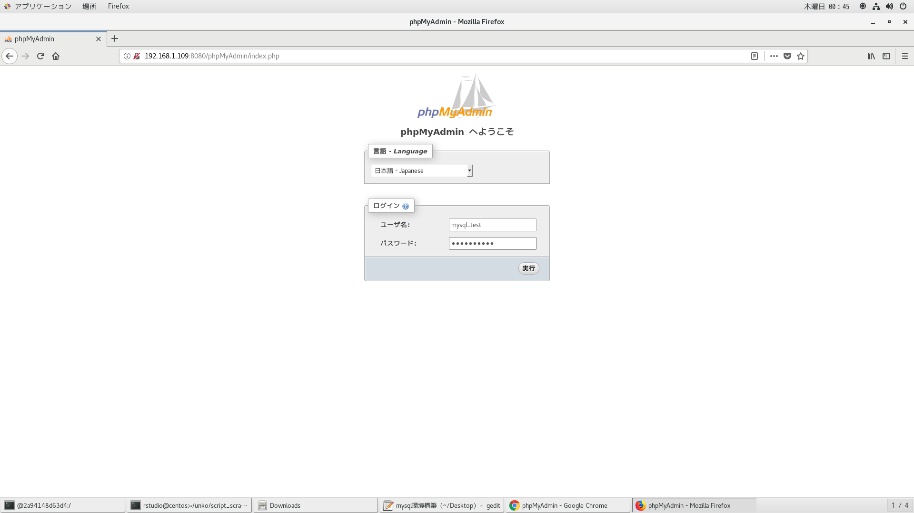
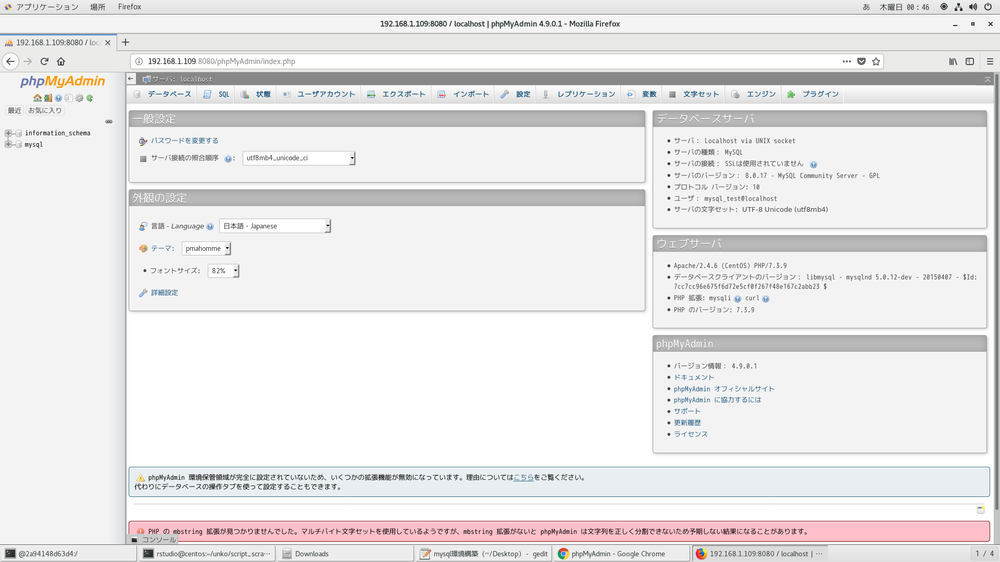

# 8.x系の動作確認

```
with sub as(
    select '[{"x":"8"},{"x":"3"},{"x":"4"}]' as rsv_args
)
select s1.rsv_args,s2.ele
from
  sub s1,json_table(
    rsv_args,
    "$[*]" columns(
      ele longtext path "$.x" 
    )
  ) as s2;
```

```
[root@7b214415ce2e /]# cat ./a.sh
#!/bin/bash

f(){
  start_rn=$1;shift;
  end_rn=$1;shift;
  mysql -uroot -pMysql3306 -t -n < <(cat <<EOS
	set @nat=${start_rn}-1;
	with nats as(
	  select @nat := @nat + 1 as n from information_schema.columns limit ${end_rn}
	) select s1.n,s2.n from nats s1,lateral(select s2.n from nats s2 where s1.n<=s2.n) s2;
EOS
) 2>/dev/null
}

f "$@"
[root@7b214415ce2e /]# ./a.sh 1 5
+------+------+
| n    | n    |
+------+------+
|    1 |    1 |
|    1 |    2 |
|    1 |    3 |
|    1 |    4 |
|    1 |    5 |
|    2 |    2 |
|    2 |    3 |
|    2 |    4 |
|    2 |    5 |
|    3 |    3 |
|    3 |    4 |
|    3 |    5 |
|    4 |    4 |
|    4 |    5 |
|    5 |    5 |
+------+------+
```

# 8.x用にちょいと変更
https://dev.mysql.com/doc/refman/8.0/en/linux-installation-yum-repo.html

```
[aine💕centos (日 12月 08 00:13:28) ~]$docker run --privileged --shm-size=8gb --name mysql -itd -v /etc/localtime:/etc/localtime -v /run/udev:/run/udev -v /run/systemd:/run/systemd -v /tmp/.X11-nix:/tmp/.X11-uni -v /var/lib/dbus:/var/lib/dbus -v /var/run/dbus:/var/run/dbus -v /etc/machine-id:/etc/machine-id centos_mysql
7b214415ce2e4bd203ea8365592523e532aa1cbdd167be965b3e1f4921eb8b3b
[aine💕centos (日 12月 08 00:13:53) ~]$dockerexec -it mysql bash
[root@7b214415ce2e /]# cd ~
[root@7b214415ce2e ~]# 

[root@067f1e228db3 ~]# curl -LO https://dev.mysql.com/get/mysql80-community-release-el7-3.noarch.rpm
[root@7b214415ce2e ~]# ll
total 32
-rw-------. 1 root root  3322 Dec  4  2018 anaconda-ks.cfg
-rw-r--r--. 1 root root 26024 Dec  8 00:14 mysql80-community-release-el7-3.noarch.rpm

[root@7b214415ce2e ~]# yum localinstall -y mysql80-community-release-el7-3.noarch.rpm 

[root@7b214415ce2e ~]# yum repolist enabled | grep "mysql.*-community.*"
mysql-connectors-community/x86_64       MySQL Connectors Community          131
mysql-tools-community/x86_64            MySQL Tools Community               100
mysql80-community/x86_64                MySQL 8.0 Community Server          145


[root@7b214415ce2e ~]# yum-config-manager --disable mysql57-community
[root@7b214415ce2e ~]# yum-config-manager --enable mysql80-community


[root@7b214415ce2e ~]# grep -A5 mysql80-community /etc/yum.repos.d/mysql-community.repo
[mysql80-community]
name=MySQL 8.0 Community Server
baseurl=http://repo.mysql.com/yum/mysql-8.0-community/el/7/$basearch/
enabled=1
gpgcheck=1
gpgkey=file:///etc/pki/rpm-gpg/RPM-GPG-KEY-mysql

[root@7b214415ce2e ~]# yum install -y mysql-community-server

[root@7b214415ce2e ~]# ll /usr/lib/systemd/system/mysqld@.service
-rw-r--r--. 1 root root 2086 Sep 20 18:22 /usr/lib/systemd/system/mysqld@.service

[root@7b214415ce2e ~]# ll /etc/systemd/system/mysqld.service
ls: cannot access /etc/systemd/system/mysqld.service: No such file or directory

[root@7b214415ce2e ~]# ln -fsr /usr/lib/systemd/system/mysqld@.service /etc/systemd/system/mysqld.service
[root@7b214415ce2e ~]# ll /etc/systemd/system/mysqld.service
lrwxrwxrwx. 1 root root 47 Dec  8 00:20 /etc/systemd/system/mysqld.service -> ../../../usr/lib/systemd/system/mysqld@.service

[root@7b214415ce2e ~]# ps -aux
USER       PID %CPU %MEM    VSZ   RSS TTY      STAT START   TIME COMMAND
root         1  0.0  0.0  11820  1684 pts/0    Ss+  00:13   0:00 /bin/bash
root        14  0.0  0.0  11820  1896 pts/1    Ss   00:13   0:00 bash
root       112  0.0  0.0  51740  1732 pts/1    R+   00:20   0:00 ps -aux

[root@7b214415ce2e ~]# systemctl status
● 7b214415ce2e
    State: running
     Jobs: 0 queued
   Failed: 0 units
    Since: Fri 2019-12-06 21:20:46 JST; 1 day 3h ago
   CGroup: /
           ├─  1 /bin/bash
           ├─ 14 bash
           ├─113 systemctl status
           └─114 more

[root@7b214415ce2e ~]# ll /var/lib/mysql/
total 0

[root@7b214415ce2e ~]# >/var/log/mysqld.log

[root@e960b9a55f89 /]# mysqld --initialize --user=mysql

[root@7b214415ce2e ~]# ll /var/lib/mysql/
total 155712
drwxr-x---. 2 mysql mysql     4096 Dec  8 00:21 #innodb_temp
-rw-r-----. 1 mysql mysql       56 Dec  8 00:21 auto.cnf
-rw-------. 1 mysql mysql     1680 Dec  8 00:21 ca-key.pem
-rw-r--r--. 1 mysql mysql     1112 Dec  8 00:21 ca.pem
-rw-r--r--. 1 mysql mysql     1112 Dec  8 00:21 client-cert.pem
-rw-------. 1 mysql mysql     1680 Dec  8 00:21 client-key.pem
-rw-r-----. 1 mysql mysql     5907 Dec  8 00:21 ib_buffer_pool
-rw-r-----. 1 mysql mysql 50331648 Dec  8 00:21 ib_logfile0
-rw-r-----. 1 mysql mysql 50331648 Dec  8 00:21 ib_logfile1
-rw-r-----. 1 mysql mysql 12582912 Dec  8 00:21 ibdata1
drwxr-x---. 2 mysql mysql     4096 Dec  8 00:21 mysql
-rw-r-----. 1 mysql mysql 25165824 Dec  8 00:21 mysql.ibd
drwxr-x---. 2 mysql mysql     4096 Dec  8 00:21 performance_schema
-rw-------. 1 mysql mysql     1676 Dec  8 00:21 private_key.pem
-rw-r--r--. 1 mysql mysql      452 Dec  8 00:21 public_key.pem
-rw-r--r--. 1 mysql mysql     1112 Dec  8 00:21 server-cert.pem
-rw-------. 1 mysql mysql     1680 Dec  8 00:21 server-key.pem
drwxr-x---. 2 mysql mysql     4096 Dec  8 00:21 sys
-rw-r-----. 1 mysql mysql 10485760 Dec  8 00:21 undo_001
-rw-r-----. 1 mysql mysql 10485760 Dec  8 00:21 undo_002

[root@7b214415ce2e ~]# cat /var/log/mysqld.log
2019-12-07T15:21:40.929636Z 0 [System] [MY-013169] [Server] /usr/sbin/mysqld (mysqld 8.0.18) initializing of server in progress as process 116
2019-12-07T15:21:43.296698Z 5 [Note] [MY-010454] [Server] A temporary password is generated for root@localhost: yu*&SO4q7ygY

[root@7b214415ce2e ~]# mysqld -D --user=mysql
mysqld will log errors to /var/log/mysqld.log
mysqld is running as pid 167

[root@7b214415ce2e ~]# cat /var/log/mysqld.log
2019-12-07T15:21:40.929636Z 0 [System] [MY-013169] [Server] /usr/sbin/mysqld (mysqld 8.0.18) initializing of server in progress as process 116
2019-12-07T15:21:43.296698Z 5 [Note] [MY-010454] [Server] A temporary password is generated for root@localhost: yu*&SO4q7ygY
2019-12-07T15:22:21.065496Z 0 [System] [MY-010116] [Server] /usr/sbin/mysqld (mysqld 8.0.18) starting as process 165
2019-12-07T15:22:21.490677Z 0 [Warning] [MY-010068] [Server] CA certificate ca.pem is self signed.
2019-12-07T15:22:21.541051Z 0 [System] [MY-010931] [Server] /usr/sbin/mysqld: ready for connections. Version: '8.0.18'  socket: '/var/lib/mysql/mysql.sock'  port: 3306  MySQL Community Server - GPL.
2019-12-07T15:22:21.612194Z 0 [System] [MY-011323] [Server] X Plugin ready for connections. Socket: '/var/run/mysqld/mysqlx.sock' bind-address: '::' port: 33060

[root@7b214415ce2e ~]# ps -aux
USER       PID %CPU %MEM    VSZ   RSS TTY      STAT START   TIME COMMAND
root         1  0.0  0.0  11820  1684 pts/0    Ss+  00:13   0:00 /bin/bash
root        14  0.0  0.0  11820  1896 pts/1    Ss   00:13   0:00 bash
mysql      167  1.5  1.2 1988952 394820 ?      Sl   00:22   0:00 mysqld -D --user=mysql
root       211  0.0  0.0  51740  1744 pts/1    R+   00:22   0:00 ps -aux

[root@7b214415ce2e ~]# systemctl status
● 7b214415ce2e
    State: running
     Jobs: 0 queued
   Failed: 0 units
    Since: Fri 2019-12-06 21:20:46 JST; 1 day 3h ago
   CGroup: /
           ├─  1 /bin/bash
           ├─ 14 bash
           ├─167 mysqld -D --user=mysql
           ├─212 systemctl status
           └─213 more

[root@7b214415ce2e ~]# mysql -uroot -p
Enter password: 
Welcome to the MySQL monitor.  Commands end with ; or \g.
Your MySQL connection id is 8
Server version: 8.0.18

Copyright (c) 2000, 2019, Oracle and/or its affiliates. All rights reserved.

Oracle is a registered trademark of Oracle Corporation and/or its
affiliates. Other names may be trademarks of their respective
owners.

Type 'help;' or '\h' for help. Type '\c' to clear the current input statement.

mysql> ALTER USER 'root'@'localhost' IDENTIFIED BY 'Mysql3306';
Query OK, 0 rows affected (0.02 sec)

mysql> select version();
+-----------+
| version() |
+-----------+
| 8.0.18    |
+-----------+
1 row in set (0.00 sec)

mysql> ^DBye

[root@7b214415ce2e ~]# mysql -uroot -pMysql3306
mysql: [Warning] Using a password on the command line interface can be insecure.
Welcome to the MySQL monitor.  Commands end with ; or \g.
Your MySQL connection id is 9
Server version: 8.0.18 MySQL Community Server - GPL

Copyright (c) 2000, 2019, Oracle and/or its affiliates. All rights reserved.

Oracle is a registered trademark of Oracle Corporation and/or its
affiliates. Other names may be trademarks of their respective
owners.

Type 'help;' or '\h' for help. Type '\c' to clear the current input statement.

mysql> select version();
+-----------+
| version() |
+-----------+
| 8.0.18    |
+-----------+
1 row in set (0.00 sec)

mysql> ^DBye

[root@e960b9a55f89 /]# cat /etc/my.cnf
# For advice on how to change settings please see
# http://dev.mysql.com/doc/refman/8.0/en/server-configuration-defaults.html

[mysqld]
#
# Remove leading # and set to the amount of RAM for the most important data
# cache in MySQL. Start at 70% of total RAM for dedicated server, else 10%.
# innodb_buffer_pool_size = 128M
#
# Remove the leading "# " to disable binary logging
# Binary logging captures changes between backups and is enabled by
# default. It's default setting is log_bin=binlog
# disable_log_bin
#
# Remove leading # to set options mainly useful for reporting servers.
# The server defaults are faster for transactions and fast SELECTs.
# Adjust sizes as needed, experiment to find the optimal values.
# join_buffer_size = 128M
# sort_buffer_size = 2M
# read_rnd_buffer_size = 2M
#
# Remove leading # to revert to previous value for default_authentication_plugin,
# this will increase compatibility with older clients. For background, see:
# https://dev.mysql.com/doc/refman/8.0/en/server-system-variables.html#sysvar_default_authentication_plugin
# default-authentication-plugin=mysql_native_password

datadir=/var/lib/mysql
socket=/var/lib/mysql/mysql.sock

log-error=/var/log/mysqld.log
pid-file=/var/run/mysqld/mysqld.pid
```


# サンプルデータベースのインストール
https://dev.mysql.com/doc/index-other.html
```
curl -LO https://github.com/datacharmer/test_db/archive/master.zip
curl -LO https://downloads.mysql.com/docs/world.sql.zip
curl -LO https://downloads.mysql.com/docs/world_x-db.zip
curl -LO https://downloads.mysql.com/docs/sakila-db.zip
curl -LO https://downloads.mysql.com/docs/menagerie-db.zip
```

# Dockerfileよりイメージ作成
```
time docker build -t centos_mysql . | tee log
```

# dockerコンテナ削除
```
docker ps -qa | xargs -I@ bash -c 'docker stop @ && docker rm @'
```

# dockerイメージ削除
```
docker images | awk '$1=="<none>"{print $3}' | xargs -I@ docker rmi @
```

# dockerコンテナ起動
```
docker run --privileged --shm-size=8gb --name mysql -itd -v /etc/localtime:/etc/localtime -v /run/udev:/run/udev -v /run/systemd:/run/systemd -v /tmp/.X11-nix:/tmp/.X11-unix -v /var/lib/dbus:/var/lib/dbus -v /var/run/dbus:/var/run/dbus -v /etc/machine-id:/etc/machine-id -p 3306:3306 -p 8080:80 centos_mysql
```

# dockerコンテナ潜入

```
docker exec --user dev -it mysql /bin/bash
docker exec --user root -it mysql /bin/bash
```

# サービス起動確認
```
[root@2315a8c47b0e ~]$systemctl status httpd
● httpd.service - The Apache HTTP Server
   Loaded: loaded (/usr/lib/systemd/system/httpd.service; disabled; vendor preset: disabled)
   Active: inactive (dead)
     Docs: man:httpd(8)
           man:apachectl(8)
[root@2315a8c47b0e ~]$systemctl start httpd
[root@2315a8c47b0e ~]$systemctl status httpd
● httpd.service - The Apache HTTP Server
   Loaded: loaded (/usr/lib/systemd/system/httpd.service; disabled; vendor preset: disabled)
   Active: active (running) since 金 2019-09-06 21:40:56 JST; 3s ago
     Docs: man:httpd(8)
           man:apachectl(8)
 Main PID: 779 (httpd)
   Status: "Processing requests..."
   CGroup: /docker/2315a8c47b0e767bef651a2e220b6f5b465135d16405e70584061de84d843c92/system.slice/httpd.service
           ├─779 /usr/sbin/httpd -DFOREGROUND
           ├─780 /usr/sbin/httpd -DFOREGROUND
           ├─781 /usr/sbin/httpd -DFOREGROUND
           ├─782 /usr/sbin/httpd -DFOREGROUND
           ├─783 /usr/sbin/httpd -DFOREGROUND
           └─784 /usr/sbin/httpd -DFOREGROUND
           ‣ 779 /usr/sbin/httpd -DFOREGROUND

 9月 06 21:40:56 2315a8c47b0e systemd[1]: Starting The Apache HTTP Server...
 9月 06 21:40:56 2315a8c47b0e httpd[779]: [Fri Sep 06 21:40:56.261585 2019] [alias:warn] [pid 779] AH00671: The Alias directive in /etc/httpd/conf.d/phpmyadmin.conf at line 5...rlier Alias.
 9月 06 21:40:56 2315a8c47b0e httpd[779]: AH00558: httpd: Could not reliably determine the server's fully qualified domain name, using 172.17.0.2. Set the 'ServerName' direct...this message
 9月 06 21:40:56 2315a8c47b0e systemd[1]: Started The Apache HTTP Server.
Hint: Some lines were ellipsized, use -l to show in full.
[root@4000ae99ae5c ~]$systemctl status mysqld
● mysqld.service - MySQL Server
   Loaded: loaded (/usr/lib/systemd/system/mysqld.service; enabled; vendor preset: disabled)
   Active: active (running) since 金 2019-09-06 00:38:17 JST; 1min 0s ago
     Docs: man:mysqld(8)
           http://dev.mysql.com/doc/refman/en/using-systemd.html
  Process: 71 ExecStartPre=/usr/bin/mysqld_pre_systemd (code=exited, status=0/SUCCESS)
 Main PID: 687 (mysqld)
   Status: "Server is operational"
   CGroup: /docker/4000ae99ae5c9e7e6602bec890f9b804aa5869c1a283a897b2376f54a3f77fee/system.slice/mysqld.service
           └─687 /usr/sbin/mysqld
           ‣ 687 /usr/sbin/mysqld

 9月 06 00:38:11 4000ae99ae5c systemd[1]: Starting MySQL Server...
 9月 06 00:38:17 4000ae99ae5c systemd[1]: Started MySQL Server.
```

# コンテナ潜入後

```
[root🖤016d33eed63b (日 12月 08 11:31:44) /home/root]$mysqld -D --user=mysql
mysqld will log errors to /var/log/mysqld.log
mysqld is running as pid 37
[root🖤016d33eed63b (日 12月 08 11:32:55) /home/root]$mysql -uroot -p$(grep password /var/log/mysqld.log | cut -d" " -f 13)
mysql: [Warning] Using a password on the command line interface can be insecure.
Welcome to the MySQL monitor.  Commands end with ; or \g.
Your MySQL connection id is 9
Server version: 8.0.18

Copyright (c) 2000, 2019, Oracle and/or its affiliates. All rights reserved.

Oracle is a registered trademark of Oracle Corporation and/or its
affiliates. Other names may be trademarks of their respective
owners.

Type 'help;' or '\h' for help. Type '\c' to clear the current input statement.

mysql> ALTER USER 'root'@'localhost' IDENTIFIED BY 'Mysql3306';
Query OK, 0 rows affected (0.03 sec)

mysql> select version();
+-----------+
| version() |
+-----------+
| 8.0.18    |
+-----------+
1 row in set (0.00 sec)

mysql> ^DBye
[root💗ab9938775985 (日 12月 08 11:45:51) /home/root]$mysql -uroot -pMysql3306
mysql: [Warning] Using a password on the command line interface can be insecure.
Welcome to the MySQL monitor.  Commands end with ; or \g.
Your MySQL connection id is 9
Server version: 8.0.18 MySQL Community Server - GPL

Copyright (c) 2000, 2019, Oracle and/or its affiliates. All rights reserved.

Oracle is a registered trademark of Oracle Corporation and/or its
affiliates. Other names may be trademarks of their respective
owners.

Type 'help;' or '\h' for help. Type '\c' to clear the current input statement.

mysql> select version();
+-----------+
| version() |
+-----------+
| 8.0.18    |
+-----------+
1 row in set (0.00 sec)

```

# ブラウザより確認
phpMyAdminの場合
```
http://192.168.1.109:8080/phpmyadmin/
```





# 参考文献
```
https://blog.apar.jp/linux/9868/
https://dev.mysql.com/doc/refman/5.6/ja/tutorial.html
https://dev.mysql.com/downloads/mysql/
https://enomotodev.hatenablog.com/entry/2016/09/01/225200
https://tecadmin.net/setup-phpmyadmin-on-linux-using-source/
http://nanisore-nikki.hatenablog.com/entry/2015/03/03/152305
```
