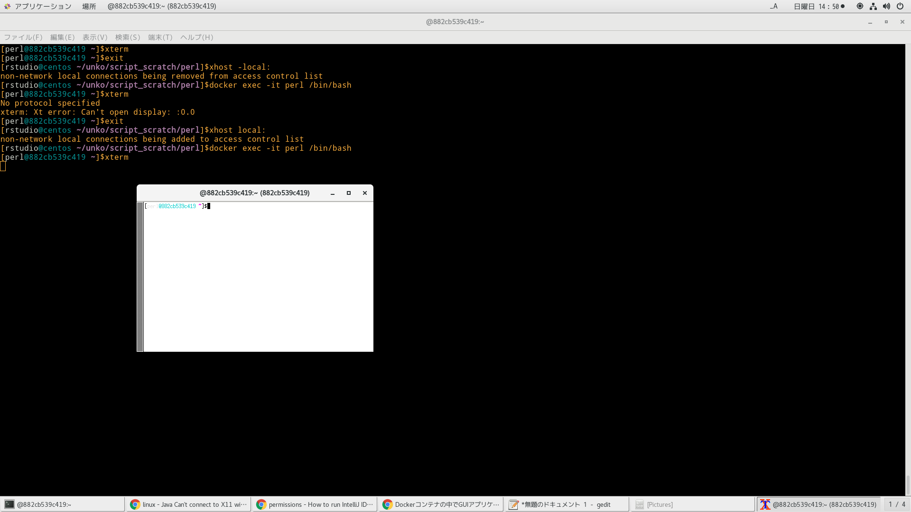

# Dockerfileよりイメージ作成
```
time docker build -t centos_perl . | tee log
```

# dockerコンテナ削除
```
docker ps -qa | xargs -I@ bash -c 'docker stop @ && docker rm @'
```

# dockerイメージ削除
```
docker images | awk '$1=="<none>"{print $3}' | xargs -I@ docker rmi @
```

# dockerコンテナ作成
```
docker run --privileged --shm-size=8gb --name perl -itd -v /run/udev:/run/udev -v /run/systemd:/run/systemd -v /tmp/.X11-unix:/tmp/.X11-unix -v /var/lib/dbus:/var/lib/dbus -v /var/run/dbus:/var/run/dbus -v /etc/machine-id:/etc/machine-id -p 28787:8787 -p 20022:22 centos_perl /sbin/init
```

# dockerホスト内でxhostコマンドによるX転送許可


dockerコンテナ内のXアプリをdockerホストに転送許可する。
ローカルネットワーク内で存在する全てのマシンからのX転送を許可している。マシン単位で設定もできる。
```
[rstudio@centos ~/unko/script_scratch/perl]$xhost local:
non-network local connections being added to access control list
```
コンテナ破棄後、X転送許可を拒むようにする。
```
[rstudio@centos ~/unko/script_scratch/perl]$xhost -local:
non-network local connections being removed from access control list
```

# dockerコンテナ潜入
```
docker exec -it perl /bin/bash
```

# 参考文献
https://www.ibm.com/support/knowledgecenter/ja/ssw_aix_71/x_commands/xhost.html
https://unskilled.site/docker%E3%82%B3%E3%83%B3%E3%83%86%E3%83%8A%E3%81%AE%E4%B8%AD%E3%81%A7gui%E3%82%A2%E3%83%97%E3%83%AA%E3%82%B1%E3%83%BC%E3%82%B7%E3%83%A7%E3%83%B3%E3%82%92%E8%B5%B7%E5%8B%95%E3%81%95%E3%81%9B%E3%82%8B/
https://www.d-wood.com/blog/2015/12/16_7734.html
http://www.omakase.org/perl/cpanm.html
https://codeday.me/jp/qa/20190817/1461604.html
https://perlmaven.com/min-max-sum-using-list-util
https://rpms.remirepo.net/rpmphp/all.php?what=jplesnik
https://papix.hatenablog.com/entry/2018/03/10/160838
https://www.javahelps.com/2015/04/install-intellij-idea-on-ubuntu.html
https://qiita.com/AnnPin/items/5f868f0c7cb5d1af306b
