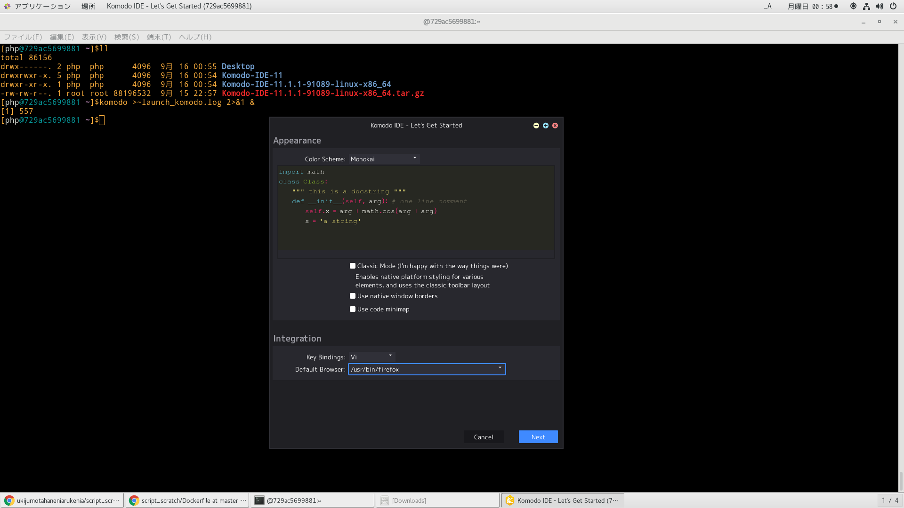
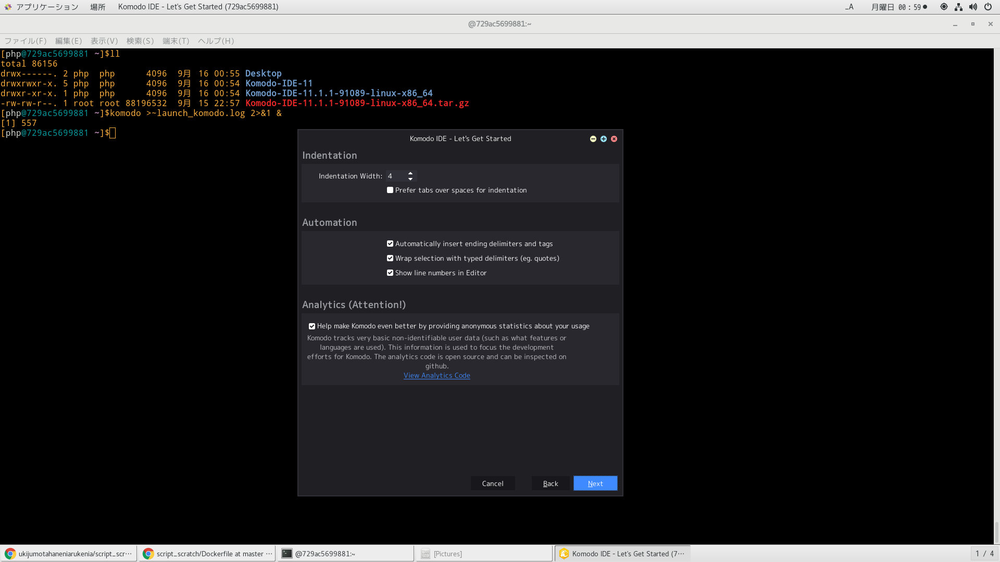
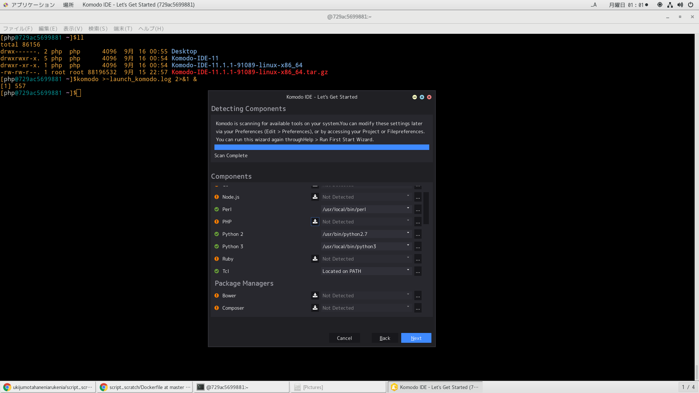
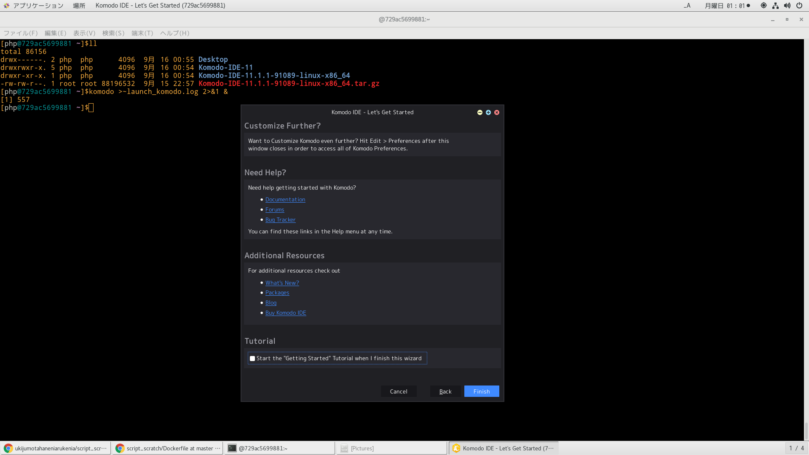
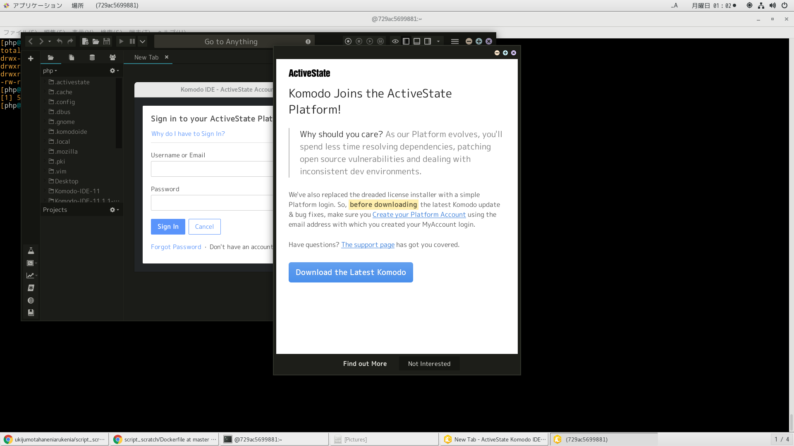
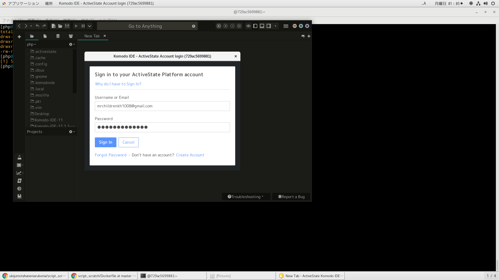

# 参考文献
https://mattintosh.hatenablog.com/entry/20140815/1408057200
https://www.activestate.com/products/komodo-ide/download-ide/#edit

# Dockerfileよりイメージ作成
```
time docker build -t centos_perl . | tee log
```

# dockerコンテナ削除
```
docker ps -qa | xargs -I@ bash -c 'docker stop @ && docker rm @'
```

# dockerイメージ削除
```
docker images | awk '$1=="<none>"{print $3}' | xargs -I@ docker rmi @
```

# dockerコンテナ作成
```
docker run --privileged --shm-size=8gb --name php -itd -v /run/udev:/run/udev -v /run/systemd:/run/systemd -v /tmp/.X11-unix:/tmp/.X11-unix -v /var/lib/dbus:/var/lib/dbus -v /var/run/dbus:/var/run/dbus -v /etc/machine-id:/etc/machine-id -p 28787:8787 -p 20022:22 centos_php /sbin/init
```

# dockerコンテナ潜入
```
docker exec -it php /bin/bash
```

# dockerコンテナ潜入後実行
```
[rstudio@centos ~/unko/script_scratch/php]$docker run --privileged --shm-size=8gb --name php -itd -v /run/udev:/run/udev -v /run/systemd:/run/systemd -v /tmp/.X11-unix:/tmp/.X11-unix -v /var/lib/dbus:/var/lib/dbus -v /var/run/dbus:/var/run/dbus -v /etc/machine-id:/etc/machine-id -p 28787:8787 -p 20022:22 centos_php /sbin/init
729ac56998811e6048a645ec1cced3c7c5e7cf73de28100cccb155479e171c0a
[rstudio@centos ~/unko/script_scratch/php]$docker exec -it php /bin/bash
[php@729ac5699881 ~/Komodo-IDE-11.1.1-91089-linux-x86_64]$ls
INSTALLDIR  install.sh  support
[php@729ac5699881 ~/Komodo-IDE-11.1.1-91089-linux-x86_64]$./install.sh
Enter directory in which to install Komodo. Leave blank and
press 'Enter' to use the default [~/Komodo-IDE-11].
Install directory: 


==============================================================================
Komodo IDE 11 has been successfully installed to:
    /home/php/Komodo-IDE-11
    
You might want to add 'komodo' to your PATH by adding the 
install dir to you PATH. Bash users can add the following
to their ~/.bashrc file:

    export PATH="/home/php/Komodo-IDE-11/bin:$PATH"

Or you could create a symbolic link to 'komodo', e.g.:

    ln -s "/home/php/Komodo-IDE-11/bin/komodo" /usr/local/bin/komodo

Documentation is available in Komodo or on the web here:
    http://docs.activestate.com/komodo

Please send us any feedback you have through one of the
channels below:
    komodo-feedback@activestate.com
    irc://irc.mozilla.org/komodo
    https://github.com/Komodo/KomodoEdit/issues

Thank you for using Komodo.
==============================================================================

[php@729ac5699881 ~/Komodo-IDE-11.1.1-91089-linux-x86_64]$
```

# komodo起動
```
[php@d46d7bac3844 ~]$komodo
[1] 535
```






