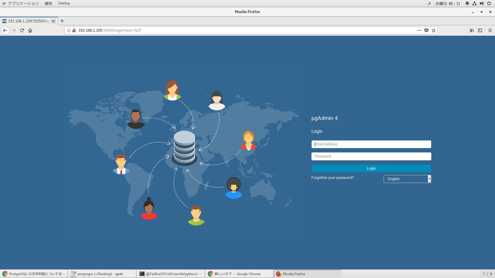
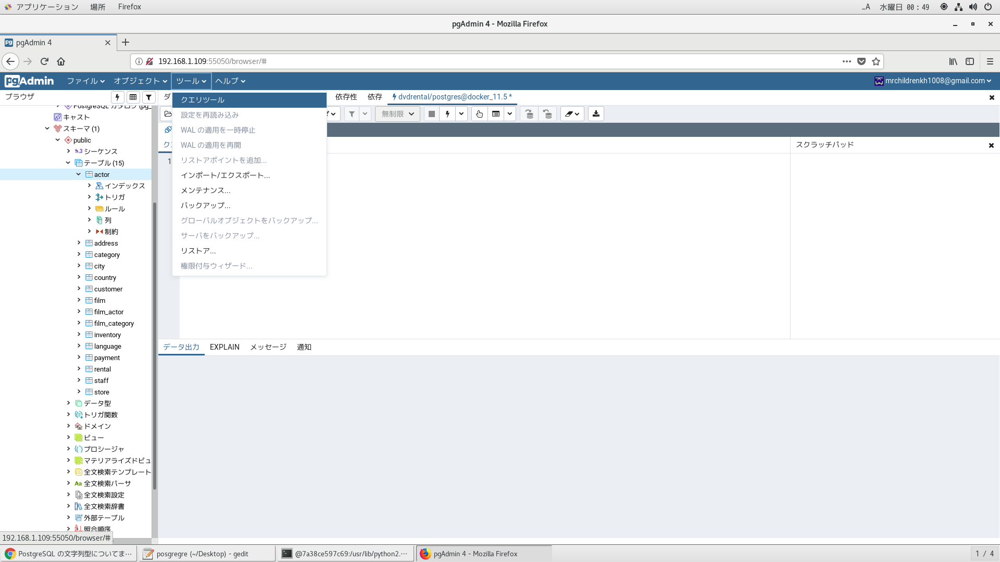
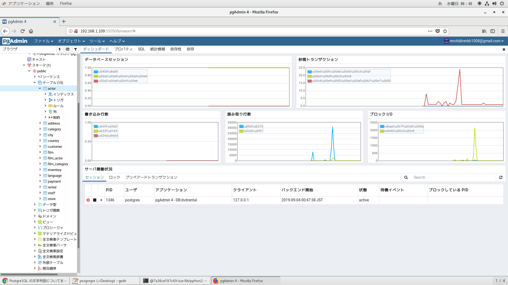
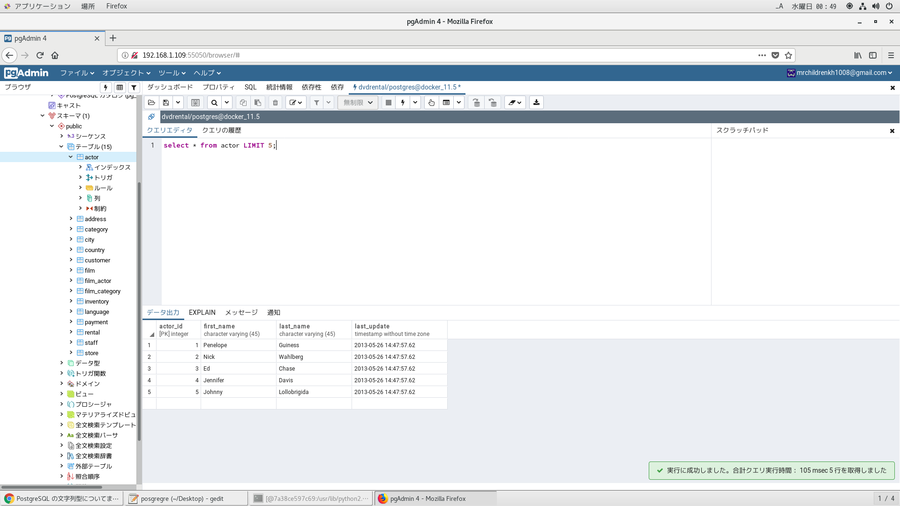

# 参考文献
https://weblabo.oscasierra.net/postgresql10-centos7-install/
http://note.kurodigi.com/centos7-postgresql/
https://freelance-jak.com/technology/postgresql/451/

https://codezine.jp/article/detail/2686


# Dockerfileよりイメージ作成
```
time docker build -t centos_postgres . | tee log
```

# dockerコンテナ削除
```
docker ps -qa | xargs -I@ bash -c 'docker stop @ && docker rm @'
```

# dockerイメージ削除
```
docker images | awk '$1=="<none>"{print $3}' | xargs -I@ docker rmi @
```

# dockerコンテナ起動
```
docker run --privileged --shm-size=8gb --name postgres -itd -v /etc/localtime:/etc/localtime -v /run/udev:/run/udev -v /run/systemd:/run/systemd -v /tmp/.X11-unix:/tmp/.X11-unix -v /var/lib/dbus:/var/lib/dbus -v /var/run/dbus:/var/run/dbus -v /etc/machine-id:/etc/machine-id -p 5432:5432 -p 5050:5050 centos_postgres
```

# ブラウザから起動確認(pgadmin)
```
http://192.168.1.109:5050/
```

# dockerコンテナ潜入
```
docker exec --user postgres -it postgres /bin/bash
docker exec --user root -it postgres /bin/bash
```

# dockerコンテナ潜入後
rootユーザーで実行。pythonはシステム共通で使用しているパスを指定。
```
[aine💚centos (土 10月 05 12:19:23) ~/script_scratch/postgres]$docker exec --user root -it postgres /bin/bash
[root🖤4718e7a94014 (土 10月 05 12:19:57) /]$cd /usr/lib/python2.7/site-packages/pgadmin4-web
[root🖤4718e7a94014 (土 10月 05 12:19:59) /usr/lib/python2.7/site-packages/pgadmin4-web]$/usr/bin/python2.7 ./setup.py
NOTE: Configuring authentication for SERVER mode.

Enter the email address and password to use for the initial pgAdmin user account:

Email address: mrchildrenkh1008@gmail.com
Password: 
Retype password:
pgAdmin 4 - Application Initialisation
======================================
```
## データベースの初期化
postgresユーザーで実行。
```
[postgres💗8800564297cd (土 10月 05 12:43:00) /]$initdb -D /var/lib/pgsql/11/data
The files belonging to this database system will be owned by user "postgres".
This user must also own the server process.

The database cluster will be initialized with locale "ja_JP.utf8".
The default database encoding has accordingly been set to "UTF8".
initdb: could not find suitable text search configuration for locale "ja_JP.utf8"
The default text search configuration will be set to "simple".

Data page checksums are disabled.

fixing permissions on existing directory /var/lib/pgsql/11/data ... ok
creating subdirectories ... ok
selecting default max_connections ... 100
selecting default shared_buffers ... 128MB
selecting default timezone ... Asia/Tokyo
selecting dynamic shared memory implementation ... posix
creating configuration files ... ok
running bootstrap script ... ok
performing post-bootstrap initialization ... ok
syncing data to disk ... ok

WARNING: enabling "trust" authentication for local connections
You can change this by editing pg_hba.conf or using the option -A, or
--auth-local and --auth-host, the next time you run initdb.

Success. You can now start the database server using:

    pg_ctl -D /var/lib/pgsql/11/data -l logfile start
``` 
## postgresサービス起動
```
[postgres💖8800564297cd (土 10月 05 12:48:24) ~]$pg_ctl -D /var/lib/pgsql/11/data -l logfile start
waiting for server to start.... done
server started
[postgres💖8800564297cd (土 10月 05 12:48:56) ~]$ll
total 3320
-rw-r--r--. 1 postgres postgres 2835456  5月 12 19:36 dvdrental.tar
-rw-r--r--. 1 postgres postgres  550906 10月  5 12:16 dvdrental.zip
-rw-r--r--. 1 postgres postgres    2233 10月  5 12:16 installer.sh
-rw-------. 1 postgres postgres     697 10月  5 12:48 logfile
```

## 外部からの接続を許可する
ローカルネットワークからのアクセスは認証なしで接続可。
修正前
```
[root@7a38ce597c69 /usr/lib/python2.7/site-packages/pgadmin4-web]$grep -E "ident|trust" /var/lib/pgsql/11/data/pg_hba.conf
# METHOD can be "trust", "reject", "md5", "password", "scram-sha-256",
# "gss", "sspi", "ident", "peer", "pam", "ldap", "radius" or "cert".
host    all             all             127.0.0.1/32            ident
host    all             all             ::1/128                 ident
host    replication     all             127.0.0.1/32            ident
host    replication     all             ::1/128                 ident
```
修正後
```
[root@7a38ce597c69 /usr/lib/python2.7/site-packages/pgadmin4-web]$grep -E "ident|trust" /var/lib/pgsql/11/data/pg_hba.conf
# METHOD can be "trust", "reject", "md5", "password", "scram-sha-256",
# "gss", "sspi", "ident", "peer", "pam", "ldap", "radius" or "cert".
host    all             all             127.0.0.1/32            trust
host    all             all             ::1/128                 ident
host    replication     all             127.0.0.1/32            ident
host    replication     all             ::1/128                 ident
```

## データベースの再起動
```
systemctl restart postgresql-11.service
```

## データベースの初期化とサービス起動＆自動起動設定
```
postgresql-11-setup initdb
systemctl start postgresql-11.service
systemctl status postgresql-11.service
systemctl enable postgresql-11.service
``` 
## pgAdmin起動。pythonはシステム共通で使用しているパスを指定。
```
[root@7a38ce597c69 /]$cd /usr/lib/python2.7/site-packages/pgadmin4-web/
[root@7a38ce597c69 /usr/lib/python2.7/site-packages/pgadmin4-web]$/usr/bin/python2.7 pgAdmin4.py
Starting pgAdmin 4. Please navigate to http://0.0.0.0:5050 in your browser.
 * Serving Flask app "pgadmin" (lazy loading)
 * Environment: production
   WARNING: Do not use the development server in a production environment.
   Use a production WSGI server instead.
 * Debug mode: off
``` 

# サンプルデータベースのリストア
tarファイルある場所でリストア
```
cd ~
psql -U postgres -c "create database dvdrental"
pg_restore -U postgres -d dvdrental dvdrental.tar
```

# サンプルデータベース接続
```
psql -l
psql -U postgres -d dvdrentals
```

# ブラウザでの表示確認





