# 参考文献
```
https://www.jetbrains.com/pycharm/download/#section=linux
```

# dockerコンテナ削除
```
docker ps -qa | xargs -I@ bash -c 'docker stop @ && docker rm @'
```

# dockerイメージ作成
```
time docker build -t centos_python . | tee log
```

# dockerイメージ削除
```
docker images | awk '$1=="<none>"{print $3}' | xargs -I@ docker rmi @
```

# dockerコンテナ作成
```
docker run --privileged --shm-size=8gb --name python -itd -v /run/udev:/run/udev -v /run/systemd:/run/systemd -v /tmp/.X11-unix:/tmp/.X11-unix -v /var/lib/dbus:/var/lib/dbus -v /var/run/dbus:/var/run/dbus -v /etc/machine-id:/etc/machine-id centos_python /sbin/init
```

# dockerコンテナ潜入
```
docker exec -it python /bin/bash
```

# pycharm起動

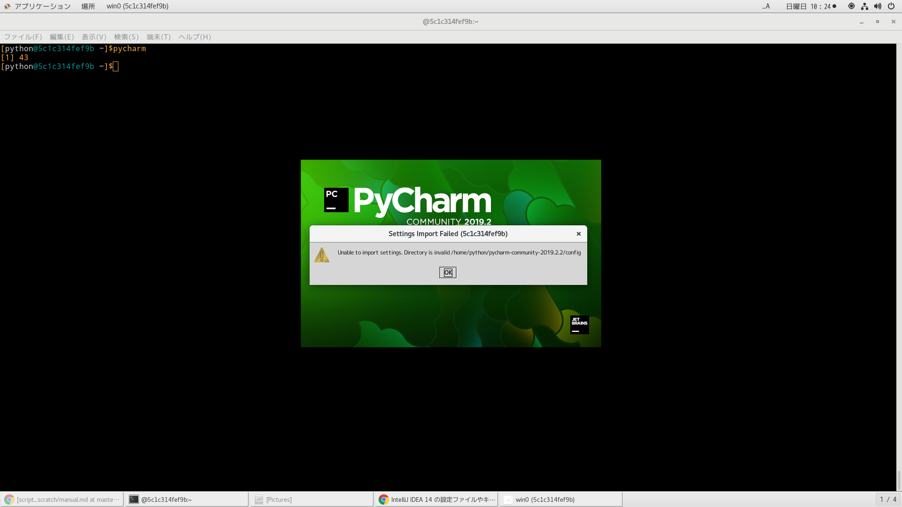
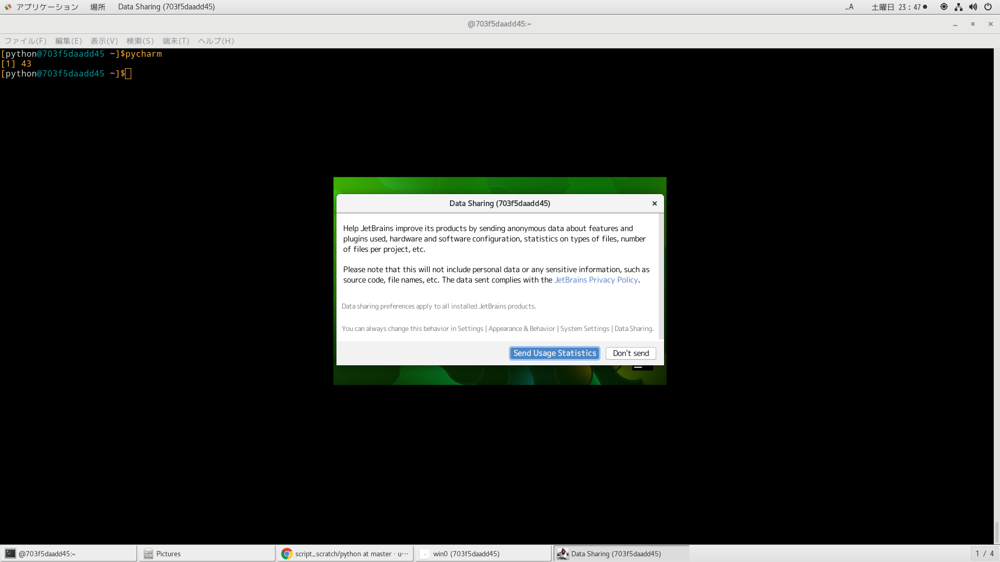
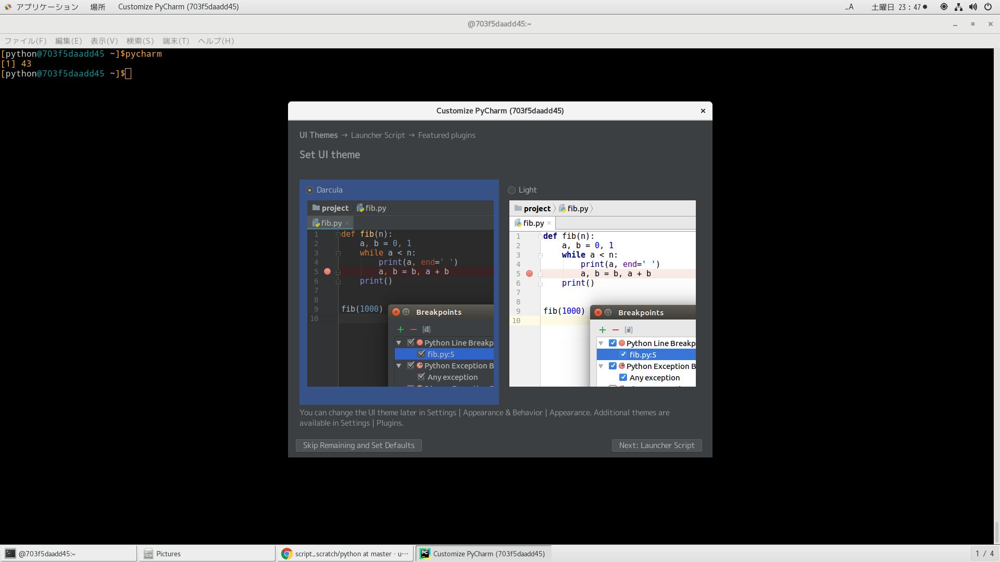
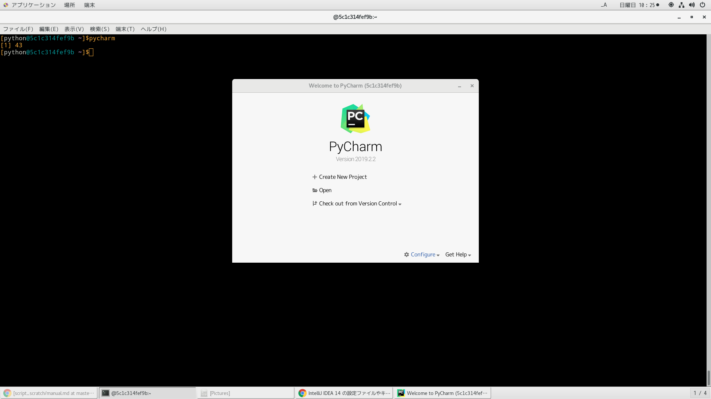
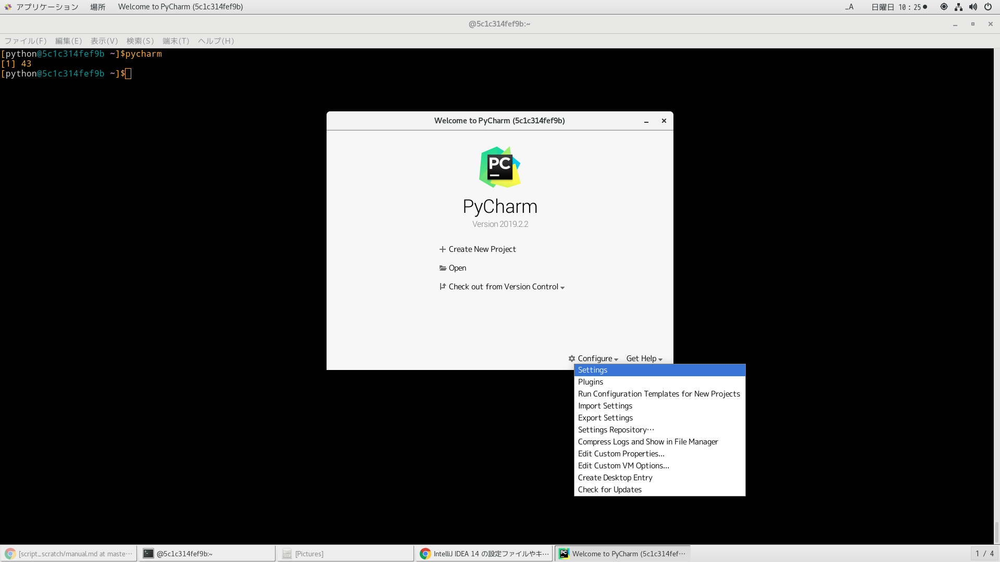
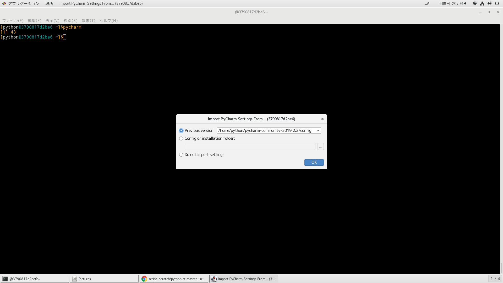
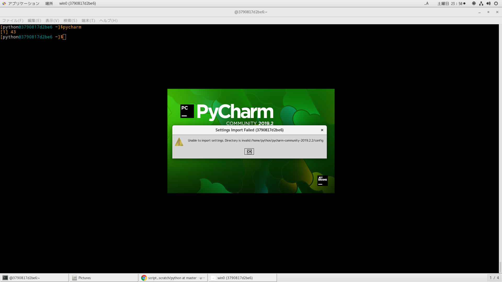
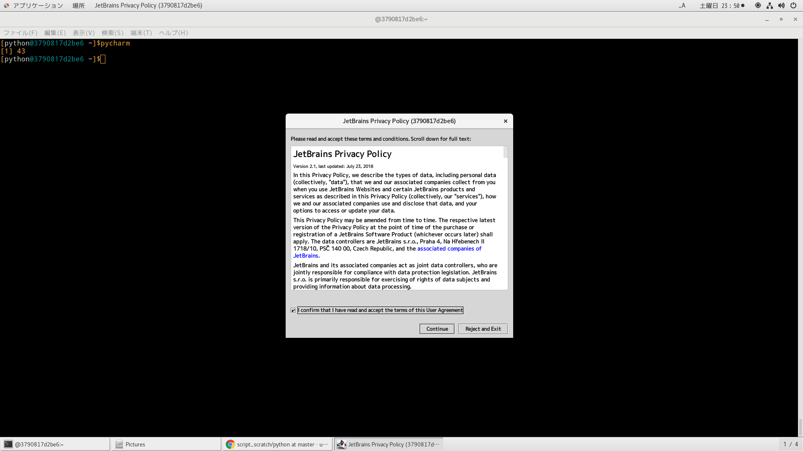
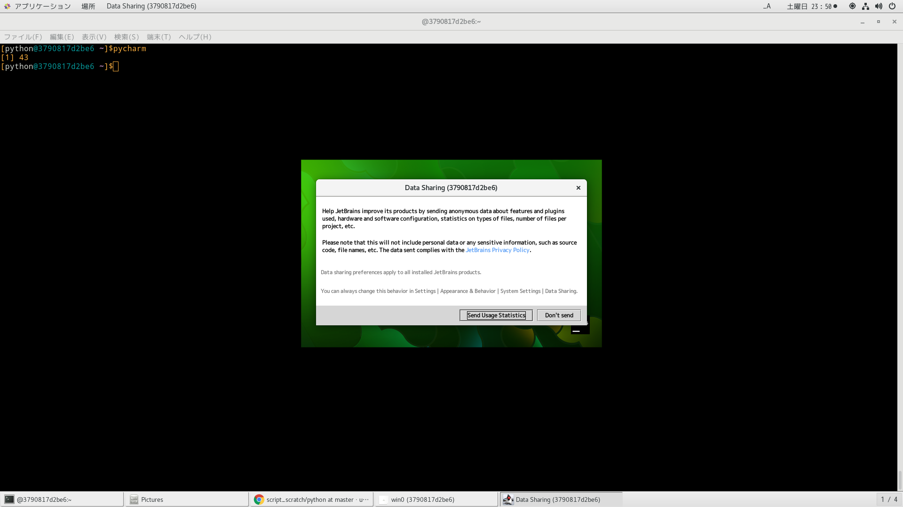
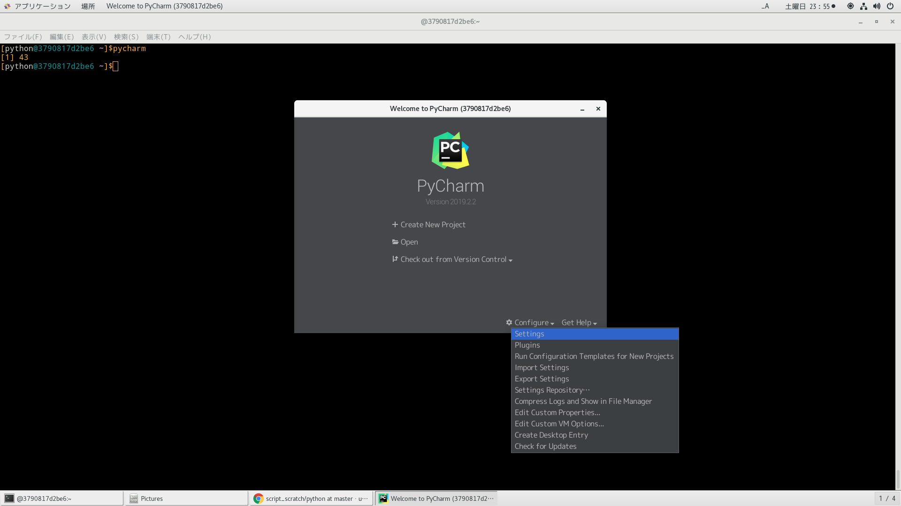
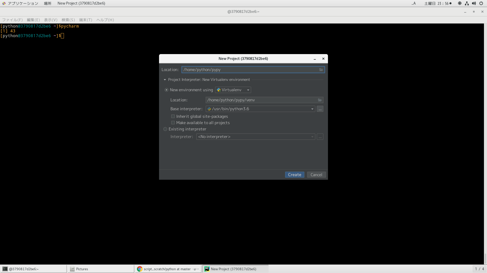
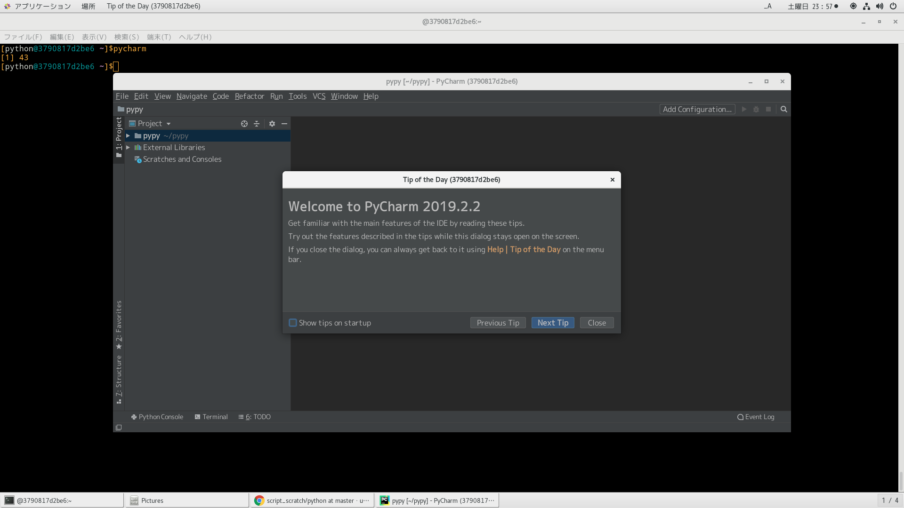
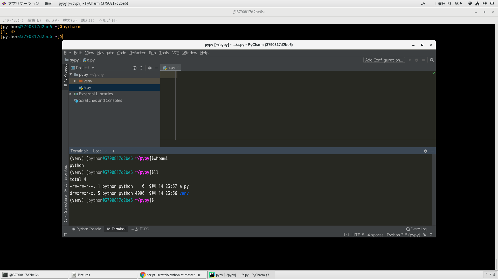
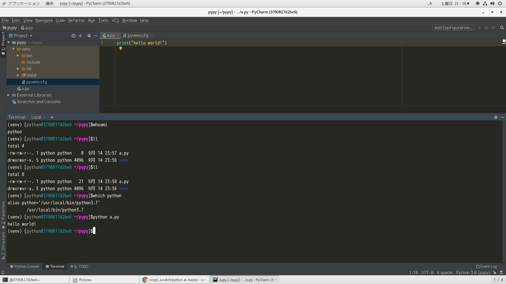
