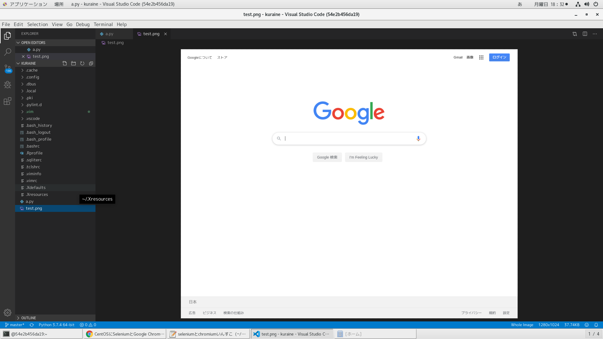

# 参考文献

https://sites.google.com/a/chromium.org/chromedriver/getting-started</br>
https://www.ytyng.com/blog/ubuntu-chromedriver/</br>
https://developers.google.com/web/updates/2017/04/headless-chrome?hl=ja</br>
https://dev.classmethod.jp/etc/chromium-ubuntu-headless/</br>
https://worklog.be/archives/3422</br>
https://vaaaaaanquish.hatenablog.com/entry/2017/06/06/194546</br>

# dockerイメージ作成

```
time docker build -t centos_selenium-chromium . | tee log
```

# dockerコンテナ作成

```
docker run --privileged --shm-size=12gb -v /run/udev:/run/udev -v /run/systemd:/run/systemd -v /tmp/.X11-unix:/tmp/.X11-unix -v /var/lib/dbus:/var/lib/dbus -v /var/run/dbus:/var/run/dbus -v /etc/machine-id:/etc/machine-id -v /etc/localtime:/etc/localtime -v /sys/fs/cgroup:/sys/fs/cgroup:ro -itd --name selenium-chromium centos_selenium-chromium
```

# dockerコンテナ潜入

```
docker exec --user kuraine -it selenium-chromium /bin/bash
```

# seleniumをpip3コマンドでいんすこ

rootユーザーで実行

```
$pip3 install --upgrade pip

$pip3 install selenium
```

# 動作確認

カレントディレクトリにtest.pngが保存されるので、VSCODEで開くと見れる!

```
#!/usr/local/bin/python3
# -*- coding: utf-8 -*-

import sys
import time
sys.path.append('/usr/local/lib/python3.7/site-packages')
from selenium import webdriver
from selenium.webdriver.chrome.options import Options

options = Options()
options.add_argument('--headless')
options.add_argument('--no-sandbox')
options.add_argument('--disable-gpu')
options.add_argument('--window-size=1280,1024')
driver = webdriver.Chrome('/usr/local/bin/chromedriver',chrome_options=options)

driver.get('http://www.google.com/')

driver.save_screenshot('test.png')

driver.quit()
```



