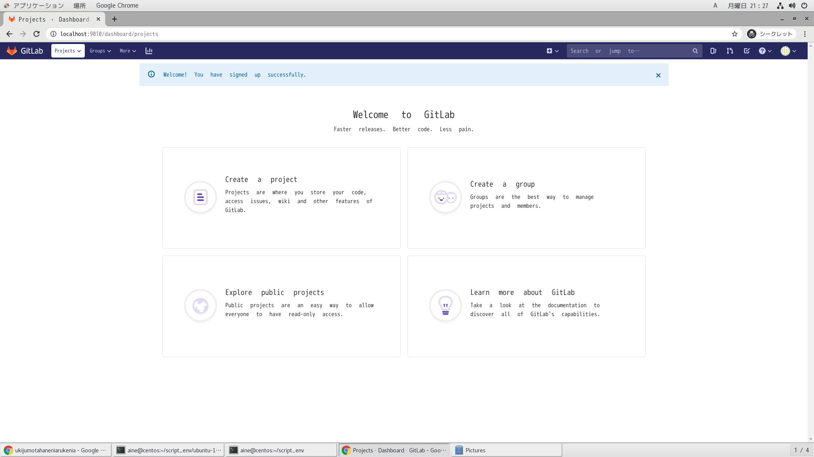
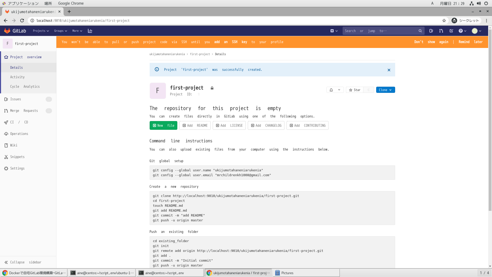
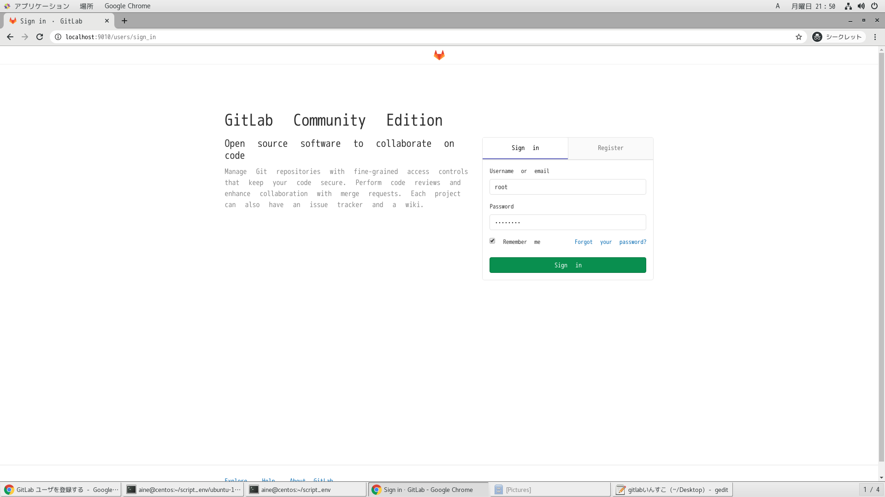

# 参考文献

- https://qiita.com/ryuichi1208/items/1c08523b0ef34d05026f

- https://qiita.com/sky_jokerxx/items/2a264a0194a5cbc7bd12

- https://about.gitlab.com/install/

# ブラウザアクセス

- コンテナ作成後4分後ぐらい
  - http://localhost:9010

# アカウント設定

- rootユーザー
- 一般ユーザー

|ユーザー名|パスワード|
|:-:|:-:|
|root|root_pwd|
|nonroot|nonroot_pwd|

