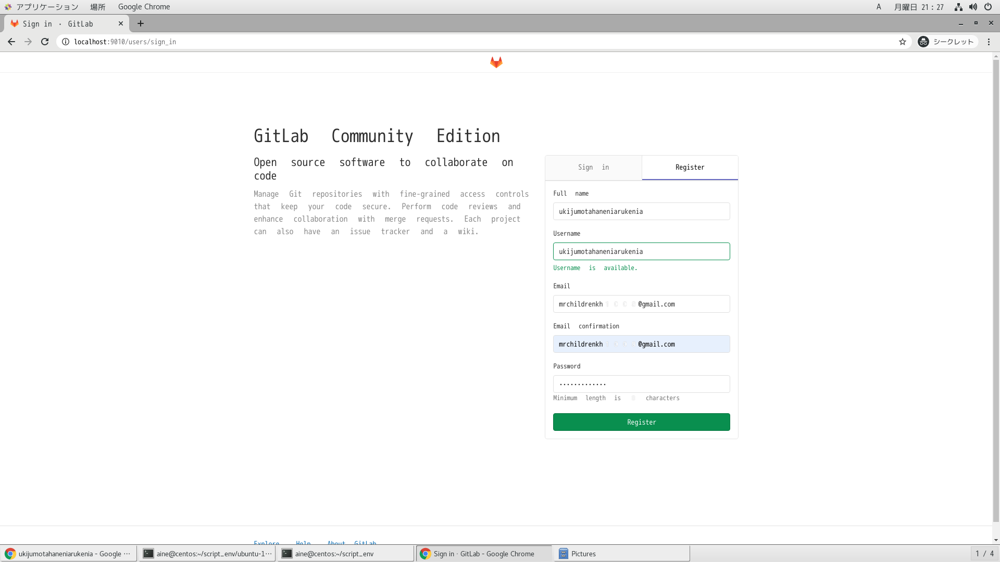
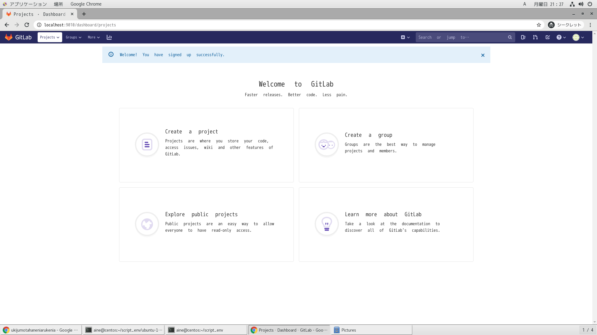
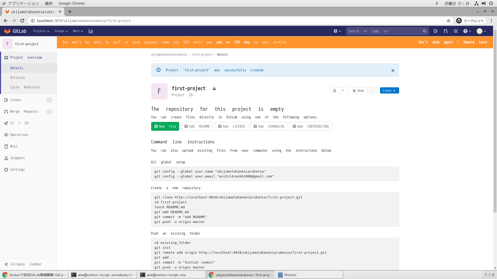
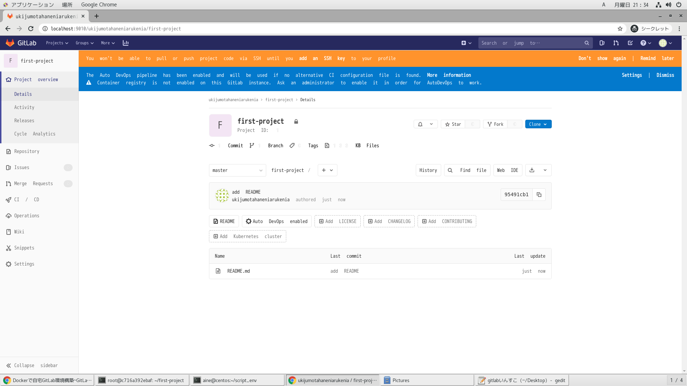
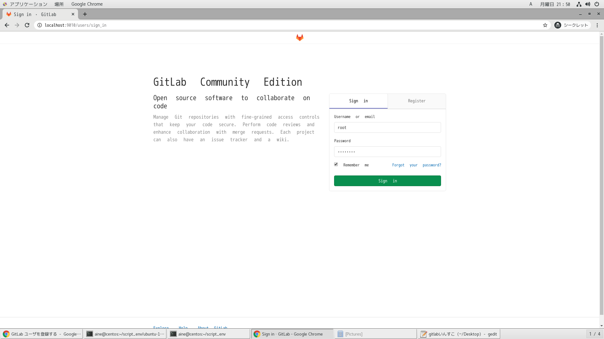
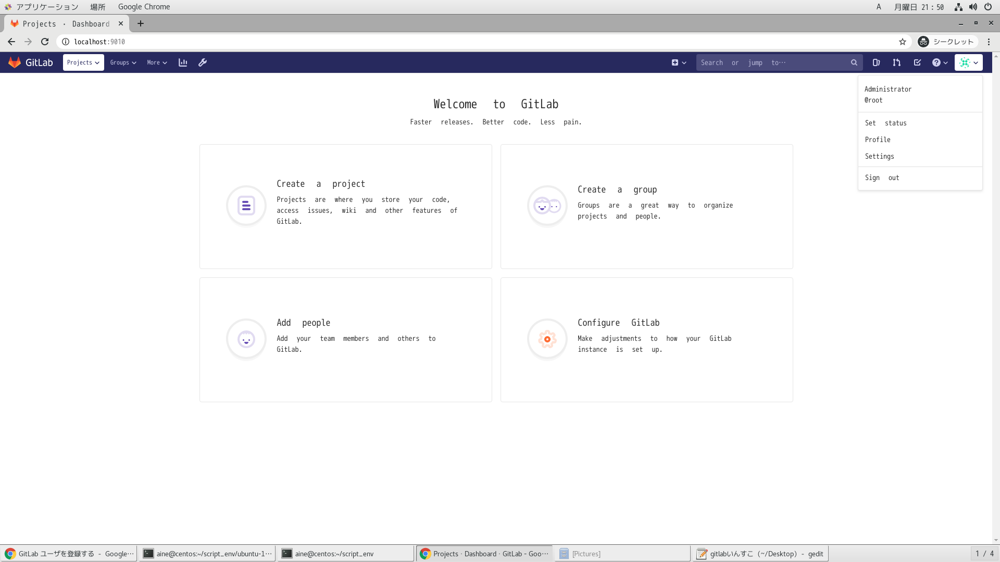
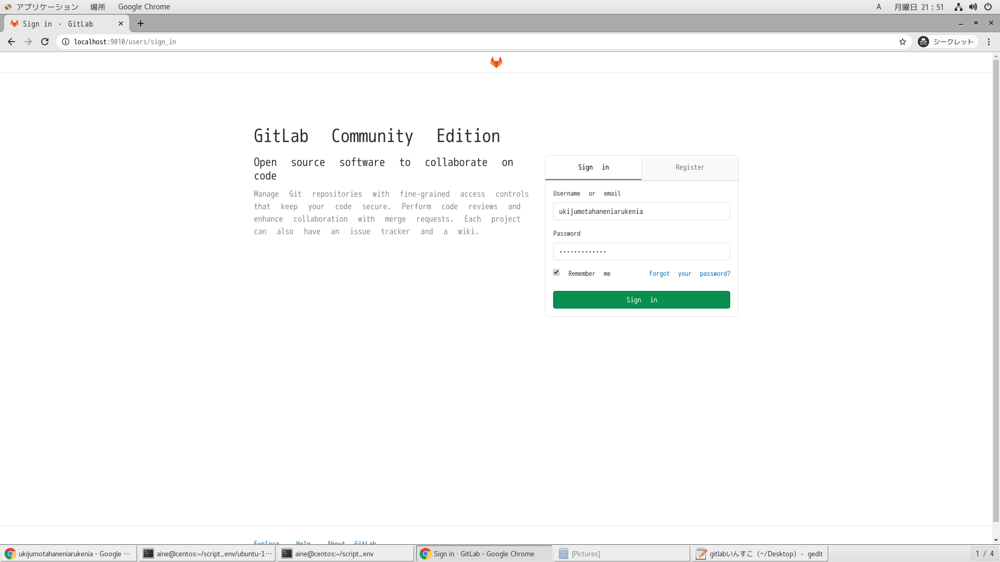

# 参考文献

- https://qiita.com/ryuichi1208/items/1c08523b0ef34d05026f

# gitlabのインストール

- https://about.gitlab.com/install/

# dockerイメージ作成

```
time docker build -t ubuntu-18-04-gitlab . | tee log
```

# dockerコンテナ削除

```
docker ps -qa | xargs -I@ bash -c 'docker stop @ && docker rm @'
```

# dockerイメージ削除

```
docker images | awk '$1=="<none>"{print $3}' | xargs -I@ docker rmi @
```

# dockerコンテナ起動

```
docker run --privileged --shm-size=16gb -v /sys/fs/cgroup:/sys/fs/cgroup:ro -v /etc/localtime:/etc/localtime -v /run/udev:/run/udev -v /run/systemd:/run/systemd -v /tmp/.X11-unix:/tmp/.X11-unix -v /var/lib/dbus:/var/lib/dbus -v /var/run/dbus:/var/run/dbus -v /etc/machine-id:/etc/machine-id -v /srv/gitlab/config:/etc/gitlab -v /srv/gitlab/logs:/var/log/gitlab -v /srv/gitlab/data:/var/opt/gitlab -p 2022:22 -p 9010:9010 --name ubuntu-18-04-gitlab -itd ubuntu-18-04-gitlab
```

# dockerコンテナ潜入

```
docker exec -it ubuntu-18-04-gitlab /bin/bash
```

# ブラウザアクセス

- コンテナ作成後4分後ぐらい
  - http://localhost:9010

# アカウント設定

- rootユーザー
- 一般ユーザー
|ユーザー名|パスワード|
|:-:|:-:|
|root|root_pwd|
|nonroot|nonroot_pwd|










