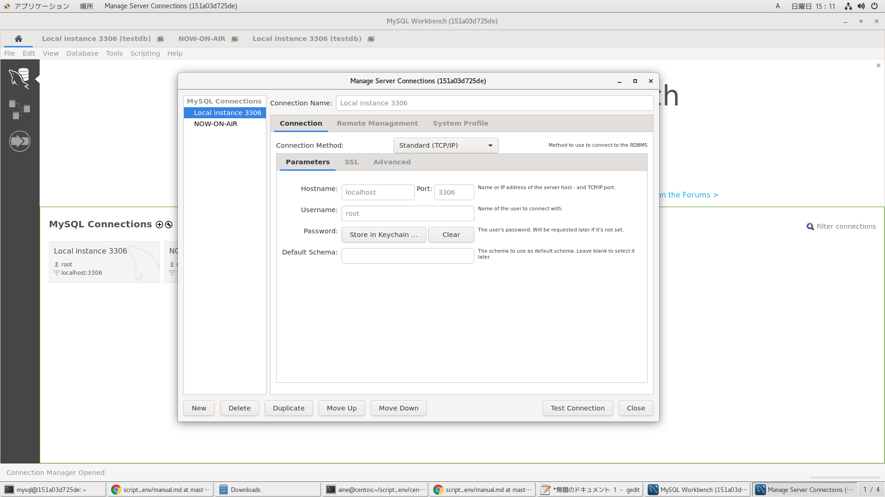
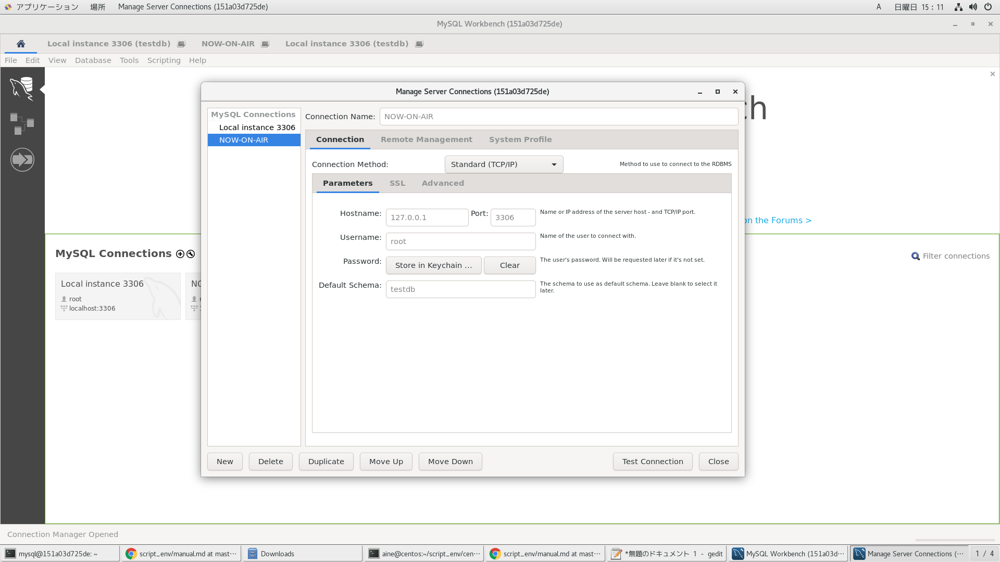
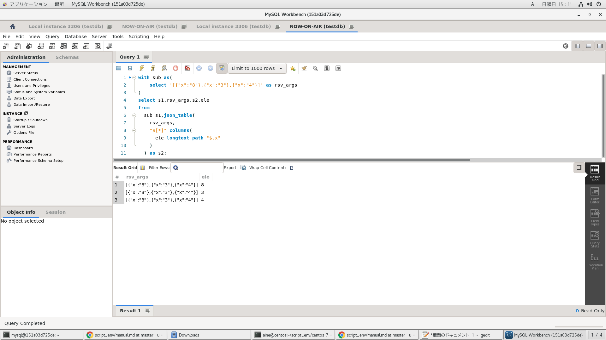
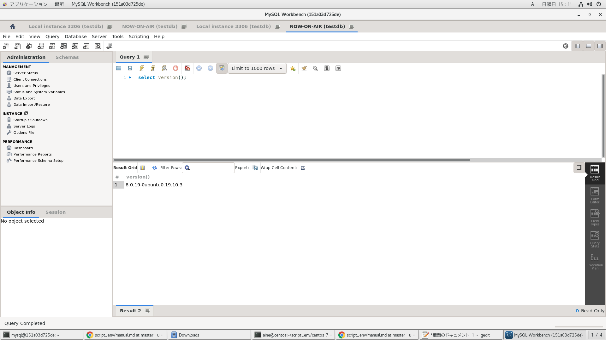

# dockerイメージ作成

```
time docker build -t ubuntu-19-10-mysql-workbench . | tee log
```

# dockerコンテナ削除

```
docker ps -qa | xargs -I@ bash -c 'docker stop @ && docker rm @'
```

# dockerイメージ削除

```
docker images | awk '$1=="<none>"{print $3}' | xargs -I@ docker rmi @
```

# dockerコンテナ起動

```
docker run --privileged --shm-size=8gb --name ubuntu-19-10-mysql-workbench -itd -v /etc/localtime:/etc/localtime -v /run/udev:/run/udev -v /run/systemd:/run/systemd -v /tmp/.X11-unix:/tmp/.X11-unix -v /var/lib/dbus:/var/lib/dbus -v /var/run/dbus:/var/run/dbus -v /etc/machine-id:/etc/machine-id -p 3306:3306 ubuntu-19-10-mysql-workbench
```

# dockerコンテナ潜入

```
docker exec -it ubuntu-19-10-mysql-workbench /bin/bash
```

# mysqlインストール

- dbus関連のエラーを回避するため、コンテナ起動後実施

```
cd /usr/local/src && curl -o mysql.deb https://repo.mysql.com/mysql-apt-config_0.8.14-1_all.deb && \
export DEBIAN_FRONTEND=noninteractive && dpkg -i mysql.deb && \
apt install -y mysql-server
```

# バージョン確認
```
$mysql --version
mysql  Ver 8.0.18-0ubuntu0.19.10.1 for Linux on x86_64 ((Ubuntu))
```

# 環境整備

rootユーザーでデータファイル等を洗い替え
- https://stackoverflow.com/questions/34954455/mysql-daemon-lock-issue

```
rm -rf /var/lib/mysql && \
>/var/log/mysql/error.log && \
mkdir -p /var/run/mysqld && \
chown mysql:mysql /var/run/mysqld && \
mysqld --initialize --user=mysql
```

# プロセス起動

バッググラウンドモードで起動
```
mysqld -D --user=mysql
```

プロセス確認
```
$ps aux
```

ログ確認
```
$tail -f /var/log/mysql/error.log
```

# mysqlプロセスでのrootユーザーのパスワードを変更

デフォルトの値をログから確認
```
$grep password /var/log/mysql/error.log | cut -d" " -f 13
?=%1ihb/B?je
```

次のコマンドを実行して、確認した値を入力する（ログからこぴぺ）
```
$mysql -uroot -p
```

rootユーザーのパスワード変更
```
ALTER USER 'root'@'localhost' IDENTIFIED BY 'Mysql3306';
```

一般ユーザーの作成
```
CREATE USER 'user01'@'localhost' IDENTIFIED BY 'Mysql3306';
```

一般ユーザーに権限付与
```
GRANT ALL PRIVILEGES ON mysql.* TO 'user01'@'localhost' WITH GRANT OPTION;
```

データベース作成
```
create database testdb;
```

データベースに対する権限付与
```
grant all privileges on testdb.* to user01@localhost;
```

# データベース接続

rootユーザー
```
mysql -uroot -pMysql3306 -Dtestdb
```

一般ユーザー
```
mysql -uuser01 -pMysql3306 -Dtestdb
```

# 動作確認

```
select version();
```

```
with sub as(
    select '[{"x":"8"},{"x":"3"},{"x":"4"}]' as rsv_args
)
select s1.rsv_args,s2.ele
from
  sub s1,json_table(
    rsv_args,
    "$[*]" columns(
      ele longtext path "$.x"
    )
  ) as s2;
```

8.x系からlateral使える
```
$cat ./a.sh
#!/bin/bash

f(){
  start_rn=$1;shift;
  end_rn=$1;shift;
  mysql -uroot -pMysql3306 -t -n < <(cat <<EOS
	set @nat=${start_rn}-1;
	with nats as(
	  select @nat := @nat + 1 as n from information_schema.columns limit ${end_rn}
	) select s1.n,s2.n from nats s1,lateral(select s2.n from nats s2 where s1.n<=s2.n) s2;
EOS
) 2>/dev/null
}

f "$@"
```
実行
```
$./a.sh 1 5
+------+------+
| n    | n    |
+------+------+
|    1 |    1 |
|    1 |    2 |
|    1 |    3 |
|    1 |    4 |
|    1 |    5 |
|    2 |    2 |
|    2 |    3 |
|    2 |    4 |
|    2 |    5 |
|    3 |    3 |
|    3 |    4 |
|    3 |    5 |
|    4 |    4 |
|    4 |    5 |
|    5 |    5 |
+------+------+
```

# ユーザー定義関数の作成

- https://qiita.com/onunu/items/71064bbf48dc40c6ce11
- https://qiita.com/okumurakengo/items/1208db98f98cb360c7ba

```
$vi factorial.cpp
$gcc --version
gcc (Ubuntu 9.2.1-9ubuntu2) 9.2.1 20191008
Copyright (C) 2019 Free Software Foundation, Inc.
This is free software; see the source for copying conditions.  There is NO
warranty; not even for MERCHANTABILITY or FITNESS FOR A PARTICULAR PURPOSE.
```

# 環境変数の設定

```
$export CPATH=/usr/include/mysql:/usr/include/c++/9
```

# コンパイル

```
$gcc factorial.cpp -shared -o /usr/lib/mysql/plugin/factorial.so
```

- ダイナミックリンクファイル作成されているか確認
```
$ll /usr/lib/mysql/plugin/factorial.so
-rwxr-xr-x. 1 root root 23640 Jan 19 17:34 /usr/lib/mysql/plugin/factorial.so*
```

# 実行

```
$mysql -uuser01 -pMysql3306 -Dtestdb
mysql: [Warning] Using a password on the command line interface can be insecure.
Welcome to the MySQL monitor.  Commands end with ; or \g.
Your MySQL connection id is 11
Server version: 8.0.18-0ubuntu0.19.10.1 (Ubuntu)

Copyright (c) 2000, 2019, Oracle and/or its affiliates. All rights reserved.

Oracle is a registered trademark of Oracle Corporation and/or its
affiliates. Other names may be trademarks of their respective
owners.

Type 'help;' or '\h' for help. Type '\c' to clear the current input statement.

mysql> create function factorial returns string soname 'factorial.so';
Query OK, 0 rows affected (0.03 sec)
mysql> select factorial(6);
+--------------+
| factorial(6) |
+--------------+
| 720          |
+--------------+
1 row in set (0.00 sec)
```

# MysqlWorkBench

```
mysql@151a03d725de:~$myb
[1] 1037
```





