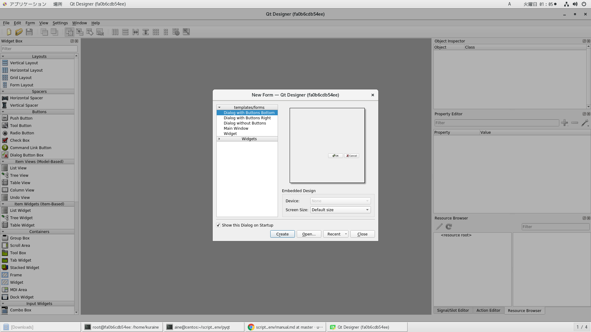
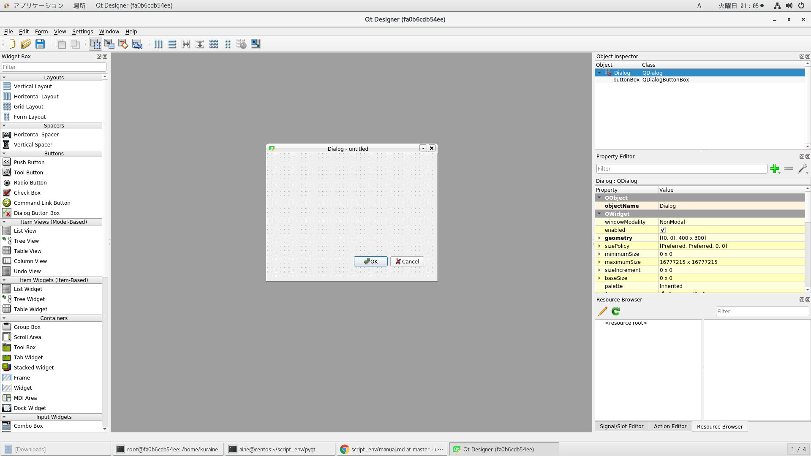

# 参考文献

https://www.slideshare.net/RansuiIso/pyqtgui</br>
https://qiita.com/Dreamwalker/items/60b9fbc931381a849525</br>
https://qiita.com/Dreamwalker/items/de2e200c09f6807932e8

# dockerイメージ作成

```
time docker build -t ubuntu-19-10-pyqt-pycharm . | tee log
```

# dockerコンテナ削除

```
docker ps -qa | xargs -I@ bash -c 'docker stop @ && docker rm @'
```

# dockerイメージ削除

```
docker images | awk '$1=="<none>"{print $3}' | xargs -I@ docker rmi @
```

# dockerコンテナ起動

```
docker run --privileged --shm-size=8gb --name ubuntu-19-10-pyqt-pycharm -itd -v /etc/localtime:/etc/localtime -v /run/udev:/run/udev -v /run/systemd:/run/systemd -v /tmp/.X11-unix:/tmp/.X11-unix -v /var/lib/dbus:/var/lib/dbus -v /var/run/dbus:/var/run/dbus -v /etc/machine-id:/etc/machine-id ubuntu-19-10-pyqt-pycharm
```

# dockerコンテナ潜入

```
docker exec -it ubuntu-19-10-pyqt-pycharm /bin/bash
```

# pycharm起動

```
$ pyc
[1] 16
$tail ~/launch_pycharm.log
```


# qt-designerコマンドいんすこ

```
$apt-get install -y qttools5-dev-tools qttools5-dev
```

このコマンド実行後、Xサーバー側のキーボード設定聞かれるが、以下のような感じで回答しておけばいい。

54->4->17

<details><summary>開く</summary><div>

```
Configuring keyboard-configuration
----------------------------------

The layout of keyboards varies per country, with some countries having multiple common layouts. Please select the country of origin for the keyboard of this computer.

  1. Afghani                   18. Chinese                 35. Filipino                                   52. Irish                          69. Montenegrin               86. Swedish
  2. Albanian                  19. Croatian                36. Finnish                                    53. Italian                        70. Nepali                    87. Switzerland
  3. Amharic                   20. Czech                   37. French                                     54. Japanese                       71. Norwegian                 88. Taiwanese
  4. Arabic                    21. Danish                  38. French (Canada)                            55. Japanese (PC-98)               72. Persian                   89. Tajik
  5. Arabic (Morocco)          22. Dhivehi                 39. French (Democratic Republic of the Congo)  56. Kazakh                         73. Polish                    90. Thai
  6. Arabic (Syria)            23. Dutch                   40. French (Guinea)                            57. Khmer (Cambodia)               74. Portuguese                91. Tswana
  7. Armenian                  24. Dzongkha                41. French (Togo)                              58. Korean                         75. Portuguese (Brazil)       92. Turkish
  8. Azerbaijani               25. English (Australian)    42. Georgian                                   59. Kyrgyz                         76. Romanian                  93. Turkmen
  9. Bambara                   26. English (Cameroon)      43. German                                     60. Lao                            77. Russian                   94. Ukrainian
  10. Bangla                   27. English (Ghana)         44. German (Austria)                           61. Latvian                        78. Serbian                   95. Urdu (Pakistan)
  11. Belarusian               28. English (Nigeria)       45. Greek                                      62. Lithuanian                     79. Sinhala (phonetic)        96. Uzbek
  12. Belgian                  29. English (South Africa)  46. Hebrew                                     63. Macedonian                     80. Slovak                    97. Vietnamese
  13. Berber (Algeria, Latin)  30. English (UK)            47. Hungarian                                  64. Malay (Jawi, Arabic Keyboard)  81. Slovenian                 98. Wolof
  14. Bosnian                  31. English (US)            48. Icelandic                                  65. Maltese                        82. Spanish
  15. Braille                  32. Esperanto               49. Indian                                     66. Maori                          83. Spanish (Latin American)
  16. Bulgarian                33. Estonian                50. Indonesian (Jawi)                          67. Moldavian                      84. Swahili (Kenya)
  17. Burmese                  34. Faroese                 51. Iraqi                                      68. Mongolian                      85. Swahili (Tanzania)
Country of origin for the keyboard: 54

Please select the layout matching the keyboard for this machine.

  1. Japanese  2. Japanese - Japanese (Dvorak)  3. Japanese - Japanese (Kana 86)  4. Japanese - Japanese (Kana)  5. Japanese - Japanese (Macintosh)  6. Japanese - Japanese (OADG 109A)
Keyboard layout: 4

You will need a way to toggle the keyboard between the national layout and the standard Latin layout.

Right Alt or Caps Lock keys are often chosen for ergonomic reasons (in the latter case, use the combination Shift+Caps Lock for normal Caps toggle). Alt+Shift is also a popular combination; it will however lose
its usual behavior in Emacs and other programs that use it for specific needs.

Not all listed keys are present on all keyboards.

  1. Caps Lock          3. Right Control  5. Right Logo key  7. Alt+Shift      9. Control+Alt     11. Left Control+Left Shift  13. Left Control  15. Left Logo key    17. No toggling
  2. Right Alt (AltGr)  4. Right Shift    6. Menu key        8. Control+Shift  10. Alt+Caps Lock  12. Left Alt                 14. Left Shift    16. Scroll Lock key
Method for toggling between national and Latin mode: 17
```

</div></details>

# pythonバージョン確認

pip3アップグレード

```
$pip3 install --upgrade pip
```

pip3アップグレード後のバージョン

```
$pip3 -V
pip 19.3.1 from /usr/local/lib/python3.7/site-packages/pip (python 3.7)
$python3 --version
Python 3.7.4
```

# pyqtライブラリいんすこ

pythonスクリプトからqtライブラリを使用できるようになる

以下を参考
https://askubuntu.com/questions/1009840/how-to-install-pyqt5 </br>
https://tutorialmore.com/questions-972030.htm </br>

rootユーザーで以下のコマンドを実行
pip3アップグレードしていないとPyQt5ライブラリいんすこ時にエラーはく

<details><summary>開く</summary><div>

```
root@fa0b6cdb54ee:/home/kuraine# pip3 install PyQt5
Collecting PyQt5
  Using cached https://files.pythonhosted.org/packages/3a/fb/eb51731f2dc7c22d8e1a63ba88fb702727b324c6352183a32f27f73b8116/PyQt5-5.14.1.tar.gz
  Installing build dependencies ... done
  Getting requirements to build wheel ... done
    Preparing wheel metadata ... error
    Complete output from command /usr/local/bin/python3.7 /usr/local/lib/python3.7/site-packages/pip/_vendor/pep517/_in_process.py prepare_metadata_for_build_wheel /tmp/tmp78mbfskl:
    Querying qmake about your Qt installation...
    /usr/bin/qmake -query
    Traceback (most recent call last):
      File "/usr/local/lib/python3.7/site-packages/pip/_vendor/pep517/_in_process.py", line 64, in prepare_metadata_for_build_wheel
        hook = backend.prepare_metadata_for_build_wheel
    AttributeError: module 'sipbuild.api' has no attribute 'prepare_metadata_for_build_wheel'
    
    During handling of the above exception, another exception occurred:
    
    Traceback (most recent call last):
      File "/usr/local/lib/python3.7/site-packages/pip/_vendor/pep517/_in_process.py", line 207, in <module>
        main()
      File "/usr/local/lib/python3.7/site-packages/pip/_vendor/pep517/_in_process.py", line 197, in main
        json_out['return_val'] = hook(**hook_input['kwargs'])
      File "/usr/local/lib/python3.7/site-packages/pip/_vendor/pep517/_in_process.py", line 67, in prepare_metadata_for_build_wheel
        config_settings)
      File "/usr/local/lib/python3.7/site-packages/pip/_vendor/pep517/_in_process.py", line 95, in _get_wheel_metadata_from_wheel
        whl_basename = backend.build_wheel(metadata_directory, config_settings)
      File "/tmp/pip-build-env-98zs_83c/overlay/lib/python3.7/site-packages/sipbuild/api.py", line 51, in build_wheel
        project = AbstractProject.bootstrap('pep517')
      File "/tmp/pip-build-env-98zs_83c/overlay/lib/python3.7/site-packages/sipbuild/abstract_project.py", line 82, in bootstrap
        project.setup(pyproject, tool, tool_description)
      File "/tmp/pip-build-env-98zs_83c/overlay/lib/python3.7/site-packages/sipbuild/project.py", line 387, in setup
        self.apply_user_defaults(tool)
      File "project.py", line 62, in apply_user_defaults
        super().apply_user_defaults(tool)
      File "/tmp/pip-build-env-98zs_83c/overlay/lib/python3.7/site-packages/pyqtbuild/project.py", line 86, in apply_user_defaults
        super().apply_user_defaults(tool)
      File "/tmp/pip-build-env-98zs_83c/overlay/lib/python3.7/site-packages/sipbuild/project.py", line 202, in apply_user_defaults
        self.builder.apply_user_defaults(tool)
      File "/tmp/pip-build-env-98zs_83c/overlay/lib/python3.7/site-packages/pyqtbuild/builder.py", line 76, in apply_user_defaults
        self._get_qt_configuration()
      File "/tmp/pip-build-env-98zs_83c/overlay/lib/python3.7/site-packages/pyqtbuild/builder.py", line 431, in _get_qt_configuration
        for line in project.read_command_pipe([self.qmake, '-query']):
      File "/tmp/pip-build-env-98zs_83c/overlay/lib/python3.7/site-packages/sipbuild/project.py", line 350, in read_command_pipe
        raise UserException("'{0}' failed returning {1}".format(cmd, rc))
    sipbuild.exceptions.UserException
    
    ----------------------------------------
Command "/usr/local/bin/python3.7 /usr/local/lib/python3.7/site-packages/pip/_vendor/pep517/_in_process.py prepare_metadata_for_build_wheel /tmp/tmp78mbfskl" failed with error code 1 in /tmp/pip-install-8go7fir6/PyQt5
You are using pip version 19.0.3, however version 19.3.1 is available.
You should consider upgrading via the 'pip install --upgrade pip' command.
```

</div></details>

```
$apt-get install -y python3-qtpy pyqt5-dev pyqt5-dev-tools python3-pyqt5 libqt5widgets5 libqt5gui5 libqt5dbus5 libqt5network5 libqt5core5a
$pip3 install SIP
$pip3 install PyQt5
```

また、以下のコマンドでpyqt5関連のライブラリパッケージの名前を検討つけられる
```
$apt-cache search pyqt5 | nl
```

# qtデザイナーを起動

以下を参考

https://pythonbasics.org/qt-designer-python/

普通に起動すると動かないが、以下のコマンドを実行したあとだと動いた
```
$strip --remove-section=.note.ABI-tag /usr/lib/x86_64-linux-gnu/libQt5Core.so.5
```

以下のコマンドはqtでプレイした結果をホームディレクトリの直下のワークスペースディレクトリに保存する
```
( mkdir -p $HOME/qt-wrksp && export XDG_RUNTIME_DIR=$HOME/qt-wrksp && cd /usr/lib/x86_64-linux-gnu/qt5/bin && ./designer 1>~/launch_qt_designer.log 2>&1 </dev/null & )
```





プロセス確認

./designerコマンドが起動されている

```
$ps aux
USER       PID %CPU %MEM    VSZ   RSS TTY      STAT START   TIME COMMAND
root         1  0.0  0.0   4076  1984 pts/0    Ss+  Jan20   0:00 /bin/bash
root     11122  0.0  0.0   4208  2332 pts/1    Ss   Jan20   0:00 /bin/bash
root     11150  0.0  0.0   6964   800 pts/1    S    Jan20   0:00 dbus-launch --autolaunch bc74deaa9e044c079ed6fc963d084157 --binary-syntax --close-stderr
root     11151  0.0  0.0   7064  1312 ?        Ss   Jan20   0:00 /usr/bin/dbus-daemon --syslog-only --fork --print-pid 5 --print-address 7 --session
root     11180  0.0  0.0   5160  2232 pts/1    S    00:07   0:00 su kuraine
kuraine  11181  0.0  0.0   4208  2216 pts/1    S    00:07   0:00 bash
kuraine  11189  0.0  0.0   4208   756 pts/1    S    00:07   0:00 bash
kuraine  11190  1.9  0.2 1592224 81100 pts/1   Sl   00:07   0:00 ./designer
kuraine  11197  0.0  0.0   6964   796 pts/1    S    00:07   0:00 dbus-launch --autolaunch bc74deaa9e044c079ed6fc963d084157 --binary-syntax --close-stderr
kuraine  11198  0.0  0.0   7064  1304 ?        Ss   00:07   0:00 /usr/bin/dbus-daemon --syslog-only --fork --print-pid 5 --print-address 7 --session
kuraine  11201  0.0  0.0   5844  1468 pts/1    R+   00:07   0:00 ps aux
```

ログ確認
```
$tail ~/launch_qt_designer.log
```
