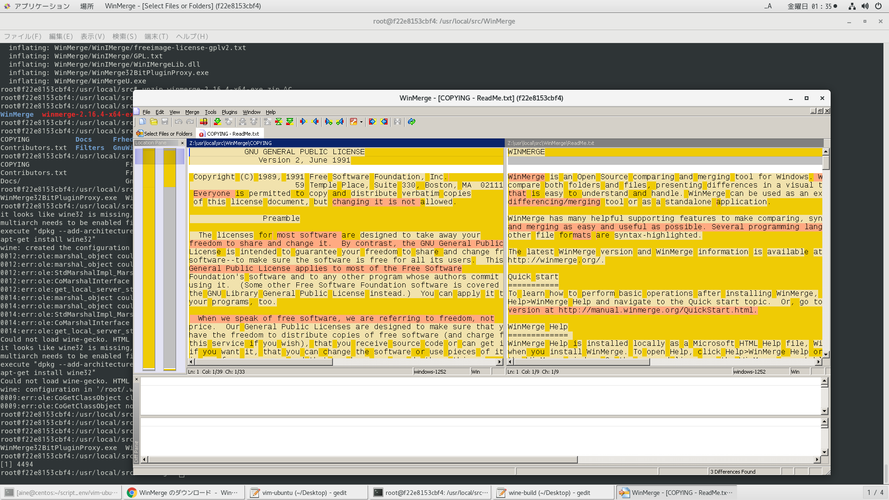

# 参考文献

- https://mongonta.com/f273-howto-install-wine-to-ubuntu/
- https://www.sejuku.net/blog/57293
- https://gigazine.net/news/20200122-wine-5-0/
- https://www.winehq.org/

# wineのインストール
https://wiki.winehq.org/Building_Wine

http://ubuntuhandbook.org/index.php/2020/01/install-wine-5-0-stable-ubuntu-18-04-19-10/

```
apt install -y wget gnupg gnupg2 gnupg1

dpkg --add-architecture i386

cd /opt && wget -nc https://dl.winehq.org/wine-builds/winehq.key; apt-key add winehq.key

apt install -y software-properties-common

apt-add-repository 'deb https://dl.winehq.org/wine-builds/ubuntu/ eoan main'

#以下のコマンドを実行した時、Enter入力を求められる
add-apt-repository ppa:cybermax-dexter/sdl2-backport

apt update

apt install -y --install-recommends winehq-stable
```

動作確認
```
$wine --version
wine-5.0
```

レポから提供されている物を利用する場合

```
apt install -y wine64
```

winアプリいんすこ

```
apt install -y curl unzip

curl -LO https://downloads.sourceforge.net/winmerge/winmerge-2.16.4-x64-exe.zip

unzip winmerge-2.16.4-x64-exe.zip

cd WinMerge

wine WinMergeU.exe 1>~/launch_win_app.log 2>&1 &
```




文字化け対策

日本語フォントをいれる

```
cd /opt

apt install -y zenity

wget https://raw.githubusercontent.com/Winetricks/winetricks/master/src/winetricks

chmod +x winetricks

winetricks
```
