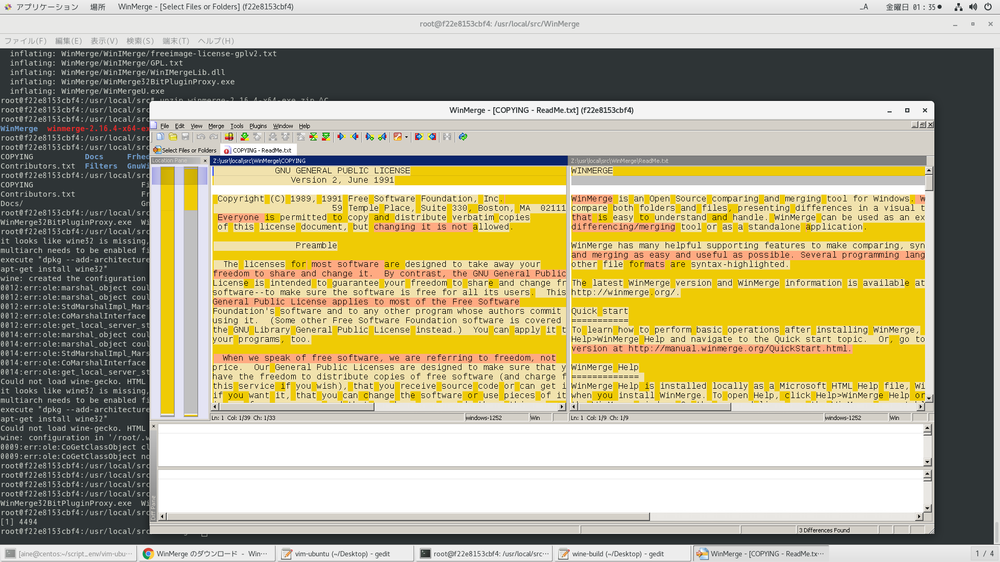

# 参考文献

https://mongonta.com/f273-howto-install-wine-to-ubuntu/ </br>

https://www.sejuku.net/blog/57293 </br>

https://gigazine.net/news/20200122-wine-5-0/ </br>

https://www.winehq.org/ </br>

# dockerコンテナ作成

```
docker run --privileged --shm-size=16gb --name ubuntu-wine -itd -v /etc/localtime:/etc/localtime -v /run/udev:/run/udev -v /run/systemd:/run/systemd -v /tmp/.X11-unix:/tmp/.X11-unix -v /var/lib/dbus:/var/lib/dbus -v /var/run/dbus:/var/run/dbus -v /etc/machine-id:/etc/machine-id ubuntu-wine
```

# dockerイメージ作成

```
time docker build -t ubuntu-wine . | tee log
```

# dockerコンテナ潜入

```
docker exec -it ubuntu-wine /bin/bash
```

# ビルド
ソースコードからビルドは相当ヒマじゃないとむりや。。。

https://wiki.winehq.org/Building_Wine


レポから提供されている物を利用

```
apt install -y wine64
```


winアプリいんすこ

```
apt install -y curl unzip

curl -LO https://downloads.sourceforge.net/winmerge/winmerge-2.16.4-x64-exe.zip

unzip winmerge-2.16.4-x64-exe.zip

cd WinMerge

wine WinMergeU.exe 1>~/launch_win_app.log 2>&1 &
```


