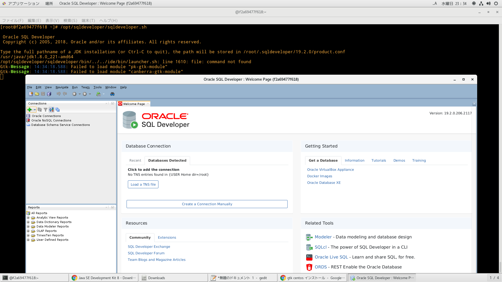
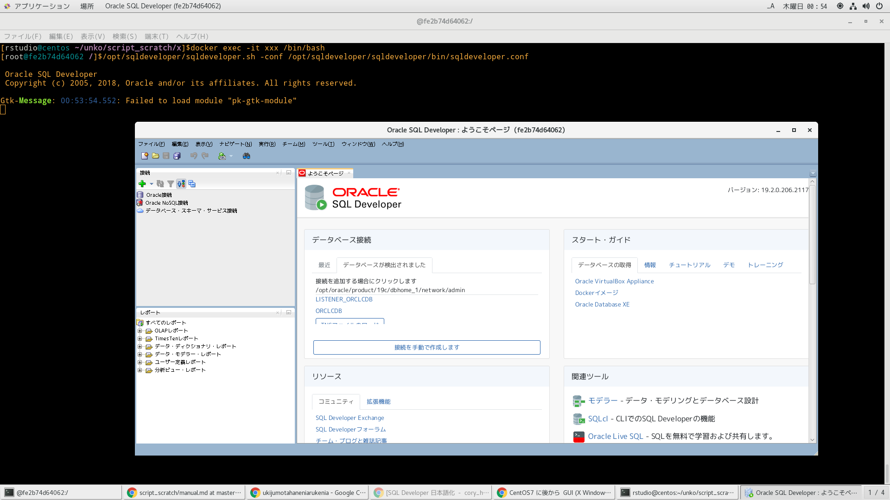
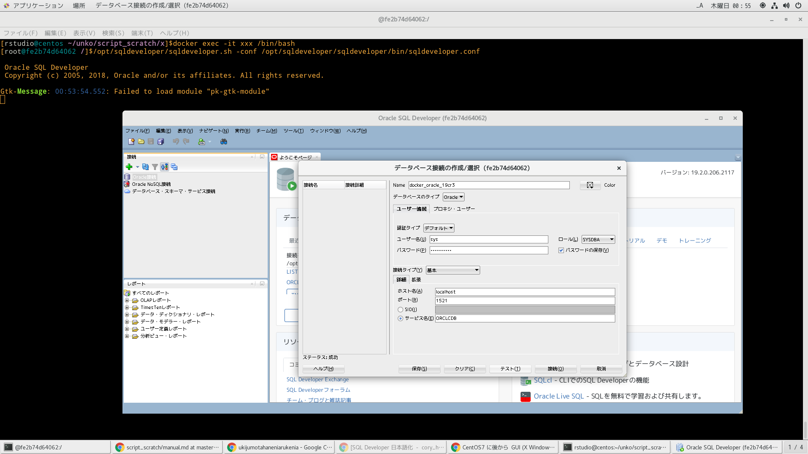
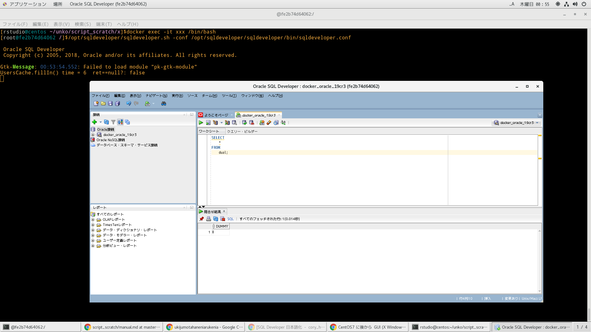

# 参考文献
https://www.itmedia.co.jp/enterprise/articles/1604/27/news001.html
https://satoru739.hatenadiary.com/entry/20111007/1318086532

xtermの色指定
https://heruwakame.hatenablog.com/entry/2017/10/21/232112
http://xjman.dsl.gr.jp/man/man1/xterm.1x.html

Xの日本語対応化
http://www.rcc.ritsumei.ac.jp/?p=6403

Xの日本語入力対応
https://qiita.com/ai56go/items/63abe54f2504ecc940cd
https://tkng.org/unixuser/200405/part1.html
https://tkng.org/unixuser/200405/part2.html
https://tkng.org/unixuser/200405/part3.html

# dockerコンテナ削除
```
docker ps -qa | xargs -I@ bash -c 'docker stop @ && docker rm @'
```

# dockerイメージ作成
```
time docker build -t centos_x . | tee log
```

# dockerコンテナ作成
DISPLAYはDISPLAY=IP or ホスト名:ディスプレイ番号.ウィンドウ番号
```
docker run --privileged --shm-size=8gb --name xxx -itd -v /run/udev:/run/udev -v /run/systemd:/run/systemd -v /tmp/.X11-unix:/tmp/.X11-unix -v /var/lib/dbus:/var/lib/dbus -v /var/run/dbus:/var/run/dbus -v /etc/machine-id:/etc/machine-id -p 28787:8787 -p 21521:1521 -p 25500:5500 centos_x /sbin/init
```

# dockerコンテナ潜入
```
docker exec -it xxx /bin/bash
```

# guiアプリいんすこ
sqldevelperでためす。
jdk必要なので、インストールしておく。
```
[rstudio@centos ~/unko/script_scratch/x]$docker exec -it xxx /bin/bash
[root@f2a69477f618 /]# cd ~
[root@f2a69477f618 ~]# ls
anaconda-ks.cfg  jdk-8u221-linux-x64.rpm  sqldeveloper-19.2.0.206.2117.noarch.rpm
[root@f2a69477f618 ~]# rpm -ivh jdk-8u221-linux-x64.rpm
warning: jdk-8u221-linux-x64.rpm: Header V3 RSA/SHA256 Signature, key ID ec551f03: NOKEY
Preparing...                          ################################# [100%]
Updating / installing...
   1:jdk1.8-2000:1.8.0_221-fcs        ^[[3~################################# [100%]
Unpacking JAR files...
	tools.jar...
	plugin.jar...
	javaws.jar...
	deploy.jar...
	rt.jar...
	jsse.jar...
	charsets.jar...
	localedata.jar...
[root@f2a69477f618 ~]# find / -name "*jdk*"
/etc/alternatives/jre_1.8.0_openjdk
/etc/alternatives/jre_openjdk_exports
/etc/alternatives/jre_openjdk
/etc/alternatives/jre_1.8.0_openjdk_exports
/usr/share/applications/java-1.8.0-openjdk-1.8.0.222.b10-0.el7_6.x86_64-policytool.desktop
/usr/share/licenses/copy-jdk-configs-3.3
/usr/share/icons/hicolor/48x48/apps/java-1.8.0-openjdk.png
/usr/share/icons/hicolor/32x32/apps/java-1.8.0-openjdk.png
/usr/share/icons/hicolor/16x16/apps/java-1.8.0-openjdk.png
/usr/share/icons/hicolor/24x24/apps/java-1.8.0-openjdk.png
/usr/libexec/copy_jdk_configs.lua
/usr/libexec/copy_jdk_configs_fixFiles.sh
/usr/lib/jvm/java-1.8.0-openjdk-1.8.0.222.b10-0.el7_6.x86_64
/usr/lib/jvm/jre-openjdk
/usr/lib/jvm/jre-1.8.0-openjdk-1.8.0.222.b10-0.el7_6.x86_64
/usr/lib/jvm/jre-1.8.0-openjdk
/usr/lib/jvm-exports/java-1.8.0-openjdk-1.8.0.222.b10-0.el7_6.x86_64
/usr/lib/jvm-exports/jre-openjdk
/usr/lib/jvm-exports/jre-1.8.0-openjdk-1.8.0.222.b10-0.el7_6.x86_64
/usr/lib/jvm-private/java-1.8.0-openjdk-1.8.0.222.b10-0.el7_6.x86_64
/usr/lib/jvm-private/java-1.8.0-openjdk-1.8.0.222.b10-0.el7_6.x86_64-debug
/usr/java/jdk1.8.0_221-amd64
/usr/java/jdk1.8.0_221-amd64/lib/visualvm/profiler/lib/deployed/jdk16
/usr/java/jdk1.8.0_221-amd64/lib/visualvm/profiler/lib/deployed/jdk15
/var/lib/alternatives/jre_1.8.0_openjdk
/var/lib/alternatives/jre_openjdk
/var/lib/yum/yumdb/c/dbe71a94571d87a467c7bdb0b742578fd88d69a7-copy-jdk-configs-3.3-10.el7_5-noarch
/var/lib/yum/yumdb/j/bbf686321e1c705198cc6a6ed81143c22ab014da-java-1.8.0-openjdk-1.8.0.222.b10-0.el7_6-x86_64
/var/lib/yum/yumdb/j/361158f5e785c711a4772fddf909692edf314c17-java-1.8.0-openjdk-headless-1.8.0.222.b10-0.el7_6-x86_64
/root/jdk-8u221-linux-x64.rpm
[root@f2a69477f618 ~]# rpm -ivh sqldeveloper-19.2.0.206.2117.noarch.rpm
Preparing...                          ################################# [100%]
Updating / installing...
   1:sqldeveloper-19.2.0-206.2117     ################################# [100%]
/var/tmp/rpm-tmp.W93czH: line 1: desktop-file-install: command not found
warning: %post(sqldeveloper-19.2.0-206.2117.noarch) scriptlet failed, exit status 127
[root@f2a69477f618 ~]# find / -name "*sqldeveloper*"
/opt/sqldeveloper
/opt/sqldeveloper/sqldeveloper.sh
/opt/sqldeveloper/sqldeveloper.exe
/opt/sqldeveloper/sqldeveloper
/opt/sqldeveloper/sqldeveloper/doc/sqldeveloper_help.jar
/opt/sqldeveloper/sqldeveloper/bin/sqldeveloper-debug.conf
/opt/sqldeveloper/sqldeveloper/bin/sqldeveloper.boot
/opt/sqldeveloper/sqldeveloper/bin/sqldeveloperW.exe
/opt/sqldeveloper/sqldeveloper/bin/sqldeveloper.conf
/opt/sqldeveloper/sqldeveloper/bin/sqldeveloper-nondebug.conf
/opt/sqldeveloper/sqldeveloper/bin/sqldeveloper64.exe
/opt/sqldeveloper/sqldeveloper/bin/sqldeveloper.exe
/opt/sqldeveloper/sqldeveloper/bin/sqldeveloper
/opt/sqldeveloper/sqldeveloper/bin/sqldeveloper64W.exe
/opt/sqldeveloper/sqldeveloper/bin/sqldeveloper-Darwin.conf
/opt/sqldeveloper/sqldeveloper/lib/oracle.sqldeveloper.jfx-nodeps.jar
/opt/sqldeveloper/sqldeveloper/lib/oracle.sqldeveloper.homesupport.jar
/opt/sqldeveloper/sqldeveloper/extensions/oracle.sqldeveloper.xmlschema.jar
/opt/sqldeveloper/sqldeveloper/extensions/oracle.sqldeveloper.utils.jar
/opt/sqldeveloper/sqldeveloper/extensions/oracle.datamodeler/reports/oracle.sqldeveloper.datamodeler_reports.59.46.zip
/opt/sqldeveloper/sqldeveloper/extensions/oracle.sqldeveloper.scheduler.jar
/opt/sqldeveloper/sqldeveloper/extensions/oracle.sqldeveloper.jar
/opt/sqldeveloper/sqldeveloper/extensions/oracle.sqldeveloper.cloud.jar
/opt/sqldeveloper/sqldeveloper/extensions/oracle.sqldeveloper.schemabrowser.jar
/opt/sqldeveloper/sqldeveloper/extensions/oracle.sqldeveloper.metrics.jar
/opt/sqldeveloper/sqldeveloper/extensions/oracle.sqldeveloper.filenavigator.jar
/opt/sqldeveloper/sqldeveloper/extensions/oracle.sqldeveloper.dbanavigator.jar
/opt/sqldeveloper/sqldeveloper/extensions/oracle.sqldeveloper.migration.jar
/opt/sqldeveloper/sqldeveloper/extensions/oracle.sqldeveloper.worksheet.jar
/opt/sqldeveloper/sqldeveloper/extensions/oracle.sqldeveloper.dbcart.jar
/opt/sqldeveloper/sqldeveloper/extensions/oracle.sqldeveloper.migration.translation.mysql.jar
/opt/sqldeveloper/sqldeveloper/extensions/oracle.sqldeveloper.thirdparty.browsers.jar
/opt/sqldeveloper/sqldeveloper/extensions/oracle.sqldeveloper.cloud.deployment.jar
/opt/sqldeveloper/sqldeveloper/extensions/oracle.sqldeveloper.jdbcproxy.jar
/opt/sqldeveloper/sqldeveloper/extensions/oracle.sqldeveloper.security.jar
/opt/sqldeveloper/sqldeveloper/extensions/oracle.sqldeveloper.snippet.jar
/opt/sqldeveloper/sqldeveloper/extensions/oracle.sqldeveloper.extras.jar
/opt/sqldeveloper/sqldeveloper/extensions/oracle.sqldeveloper.swift.jar
/opt/sqldeveloper/sqldeveloper/extensions/oracle.sqldeveloper.hadoopconnectors.jar
/opt/sqldeveloper/sqldeveloper/extensions/oracle.sqldeveloper.rdfgraph.jar
/opt/sqldeveloper/sqldeveloper/extensions/oracle.sqldeveloper.listener.jar
/opt/sqldeveloper/sqldeveloper/extensions/oracle.sqldeveloper.unit_test.jar
/opt/sqldeveloper/sqldeveloper/extensions/oracle.sqldeveloper.spatial.jar
/opt/sqldeveloper/sqldeveloper/extensions/oracle.sqldeveloper.migration.sqlserver.jar
/opt/sqldeveloper/sqldeveloper/extensions/oracle.sqldeveloper.timesten.jar
/opt/sqldeveloper/sqldeveloper/extensions/oracle.sqldeveloper.cloud.migrations.jar
/opt/sqldeveloper/sqldeveloper/extensions/oracle.sqldeveloper.migration.translation.gui.jar
/opt/sqldeveloper/sqldeveloper/extensions/oracle.sqldeveloper.onsd
/opt/sqldeveloper/sqldeveloper/extensions/oracle.sqldeveloper.migration.translation.core.jar
/opt/sqldeveloper/sqldeveloper/extensions/oracle.sqldeveloper.ssh.jar
/opt/sqldeveloper/sqldeveloper/extensions/oracle.sqldeveloper.report.jar
/opt/sqldeveloper/sqldeveloper/extensions/oracle.sqldeveloper.migration.msaccess.jar
/opt/sqldeveloper/sqldeveloper/extensions/oracle.sqldeveloper.datamodeler_reports.jar
/opt/sqldeveloper/sqldeveloper/extensions/oracle.sqldeveloper.macos.jar
/opt/sqldeveloper/sqldeveloper/extensions/oracle.sqldeveloper.migration.translation.db2.jar
/opt/sqldeveloper/sqldeveloper/extensions/oracle.sqldeveloper.migration.sybase.jar
/opt/sqldeveloper/sqldeveloper/extensions/oracle.sqldeveloper.em_cm.jar
/opt/sqldeveloper/sqldeveloper/extensions/oracle.sqldeveloper.migration.application.jar
/opt/sqldeveloper/sqldeveloper/extensions/oracle.sqldeveloper.rest.jar
/opt/sqldeveloper/sqldeveloper/extensions/oracle.sqldeveloper.migration.mysql.jar
/opt/sqldeveloper/sqldeveloper/extensions/oracle.sqldeveloper.migration.teradata.jar
/opt/sqldeveloper/sqldeveloper/extensions/oracle.sqldeveloper.migration.translation.teradata.jar
/opt/sqldeveloper/sqldeveloper/extensions/oracle.sqldeveloper.sqlmonitor.jar
/opt/sqldeveloper/sqldeveloper/extensions/oracle.sqldeveloper.migration.postgresql.jar
/opt/sqldeveloper/sqldeveloper/extensions/oracle.sqldeveloper.migration.db2.jar
/opt/sqldeveloper/sqldeveloper/extensions/oracle.sqldeveloper.unit_test
/opt/sqldeveloper/sqldeveloper/extensions/oracle.sqldeveloper.rdfgraph
/opt/sqldeveloper/sqldeveloper/extensions/oracle.sqldeveloper.onsd.jar
/opt/sqldeveloper/sqldeveloper/extensions/oracle.sqldeveloper.tuning.jar
/opt/sqldeveloper/external/oracle.sqldeveloper.utils-nodeps.jar
/opt/sqldeveloper/sqldeveloper.desktop
/usr/local/bin/sqldeveloper
/root/sqldeveloper-19.2.0.206.2117.noarch.rpm
```

# gui起動
```
[rstudio@centos ~/unko/script_scratch/x]$docker exec -it xxx /bin/bash
[root@fe2b74d64062 /]$/opt/sqldeveloper/sqldeveloper.sh -conf /opt/sqldeveloper/sqldeveloper/bin/sqldeveloper.conf

 Oracle SQL Developer
 Copyright (c) 2005, 2018, Oracle and/or its affiliates. All rights reserved.

Gtk-Message: 00:53:54.552: Failed to load module "pk-gtk-module"
UsersCache.fillIn() time = 6  ret==null?: false
```






